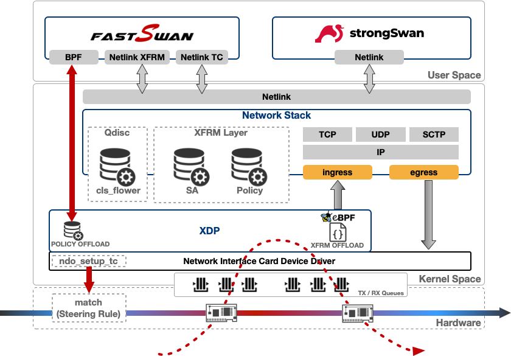

# fastSwan: XFRM offload via XDP

is a routing software written in C. The main goal of this project is to provide a fast data-path for the Linux Kernel <b>XFRM</b> layer. Some NIC vendors offer <b>IPSEC</b> acceleration via a <b>Crypto</b> mode or a <b>Packet</b> mode. In Packet mode, all IPSEC ESP operations are done by the hardware to offload the kernel for crypto and packet handling. To further increase perfs we implement kernel routing <b>offload</b> via <b>XDP</b>. A XFRM kernel netlink reflector is dynamically and transparently mirroring kernel XFRM policies to the XDP layer for kernel netstack bypass. fastSwan is an XFRM offload feature.

fastSwan is free software; you can redistribute it and/or modify it under the terms of the GNU Affero General Public License Version 3.0 as published by the Free Software Foundation.

---

IPsec is natively supported by the Linux Kernel via its XFRM layer. This feature is widely used in broadband and mobile network infrastructures. strongSwan software has become the de facto standard for running IPsec on Linux systems. Thanks to the efforts and long-term support of the strongSwan team, it has also become a reference cornerstone for interoperability. In this context, fastSwan is a side companion of strongSwan for its data-path which makes extensive use of eBPF/XDP. Netlink broadcast channel with the Linux Kernel is used to mirror XFRM policies to eBPF program. This eBPF program is loaded at the XDP layer and is routing/forwarding traffic directly at the netdevice ingress. Kernel XFRM is then offloaded and forwarding is done directly in the context of the netdevice driver. fastSwan only handles traffic for XFRM policies using HW offload.

fastSwan also ships a `flower-mode` (aka `furious-mode`) forwarding model that pushes the forwarding path into the NIC via tc flower.

