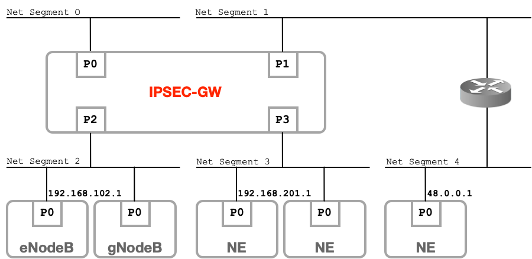

IPsecGW connects multiple network segments and routes traffic between its interfaces. It is then a routing device and can operate in 2 network routing scenarios:

* **Connected Network** : Routing traffic between directly connected networks. The figure shows where *192.168.201.1* wants to reach *192.168.102.1*. This scenario is used in small networks where there is a limited and controlled number of subnets.

* **Routed Network** : Routing traffic from directly connected network via a router to reach a remote network. The figure shows where *48.0.0.1* wants to reach *192.168.102.1*. This scenario is used by large network operators where IPsecGW acts as a security border router inter-connecting multiple partner networks.
