*Alexandre Cassen*, <<acassen@gmail.com>> |
*Vincent Bernat*, <<vincent@bernat.ch>>
---

Network equipment evaluation relies on repetitive and incremental testing to
identify and qualify bottlenecks. The test protocol presented here was used during
implementation and integrated into development iterations. Rather than implement
and then test, we implemented and tested together as part of the same process to
quickly validate intuitions and quickly invalidate assumptions.

Various testing and benchmarking tools are available and widely used. Each one has
its own specificities and features. A clear and concrete definition of the target
use case guides the decision. In our case, the goal is to run and test the
solution on a wild telco operator network dealing with a bunch of traffic ranging
from broadband access to mobile device user equipment. The best tool available, taking
into account all our constraints, was [TRex OpenSource project from Cisco Systems].

Our tests are focused and based on Nvidia networking solutions as they are now the
easiest and best integrated solution for IPsec HW offload. ConnectX-7 NICs (CX7)
can be used in a standard box with plenty of CPU and RAM. Rather, we chose to test
the CX7 with its integration into the Nvidia Bluefield-3 (BF3) product running in
DPU mode. The BF3 HW is really good and offers an integrated all-in-one box instead
of integrating several high-profile components. The BF3 HW used was :

* Device Type: BlueField3
* Part Number: 900-9D3B6-00CV-A_Ax
* Description: NVIDIA BlueField-3 B3220 P-Series FHHL DPU; 200GbE (default mode) / NDR200 IB; Dual-port QSFP112; PCIe Gen5.0 x16 with x16 PCIe extension option; 16 Arm cores; 32GB on-board DDR; integrated BMC; Crypto Enabled

For perfs evaluations of security components, our testing, focus, and policy is to
use and rely on standard open source auditable source code. We do not run BF3 with
the standard BFB image. Instead, we run a simple buildroot image that includes the
following items:

* Standard Linux Kernel from [kernel.org] : All tests has been done using Linux 6.14 as
  available in the [kernel/git/leon/linux-rdma.git ipsec-fixes branch]. We highly
  recommand using this branch while all these patches are not fully merged mainline.
* Last stable strongSwan supporting hw_offload option. At the time of writing,
  [strongSwan version 6.0.0] is a good choice.
* fastSwan: available on [fastSwan GitHub's repo].

This work has been done in close collaboration with Nvidia R&D Kernel Team. (Leon: if
you are reading these lines: Thank you for your quick support throughout all this process.)

  [TRex OpenSource project from Cisco Systems]: https://trex-tgn.cisco.com/
  [kernel.org]: https://kernel.org
  [kernel/git/leon/linux-rdma.git ipsec-fixes branch]: https://git.kernel.org/pub/scm/linux/kernel/git/leon/linux-rdma.git/log/?h=ipsec-fixes
  [strongSwan version 6.0.0]: https://strongswan.org/download.html
  [fastSwan GitHub's repo]: https://github.com/acassen/fastswan


## TRex benchmark setup
We will not describe TRex in detail, please refer to [TRex website] for more
information and detailed features available. Basically, TRex is a traffic generator,
sending traffic from one network interface and receiving the same traffic on another.
Then TRex analyzes delta consolidated KPI information (drops, latency, loss, ...)
between the sent and received traffic. In a standard TRex setup, a DUT (Device Under
Test) is stressed under traffic pressure. In our IPsec use case, we define the TRex
DUT as a set of 2 Nvidia BF3 nodes. Each BF3 node receives unencrypted traffic on its
P1 port and encapsulates encrypted traffic on its P0 port. This setup provides a single
data-path for both cipher & uncipher operations. The blue arrows in the following
figure illustrate traffic generation:

<p style="text-align: center">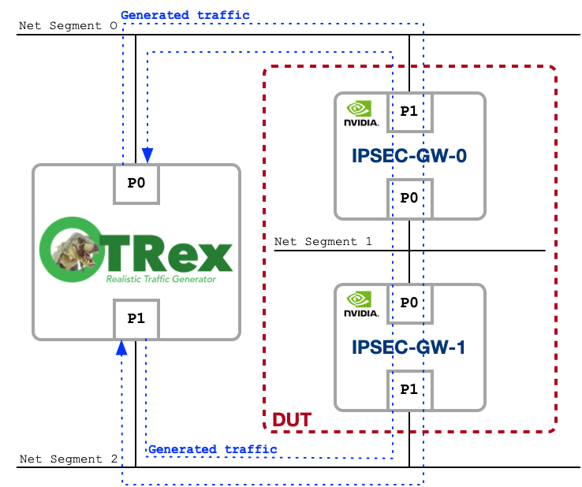</p>

Building a DUT with 2 BF3s in back-to-back mode is a worst case for benchmarking
because the HW limits are hit twice on the data path. This setup is a performance
limit amplifier. As a realistic traffic generator, TRex supports multiple streams
with different profiles. We build an [Internet MIX table] (**iMIX**) to model traffic
patterns as observed in production patterns and build TRex streams from it. The
final TRex feature is a traffic amplifier, which gradually increases the traffic
to stress test the DUT.

  [TRex website]: https://trex-tgn.cisco.com/
  [Internet MIX table]: https://en.wikipedia.org/wiki/Internet_Mix

## Network LAB setup

The following topology is used for all benchmarks :
<p style="text-align: center">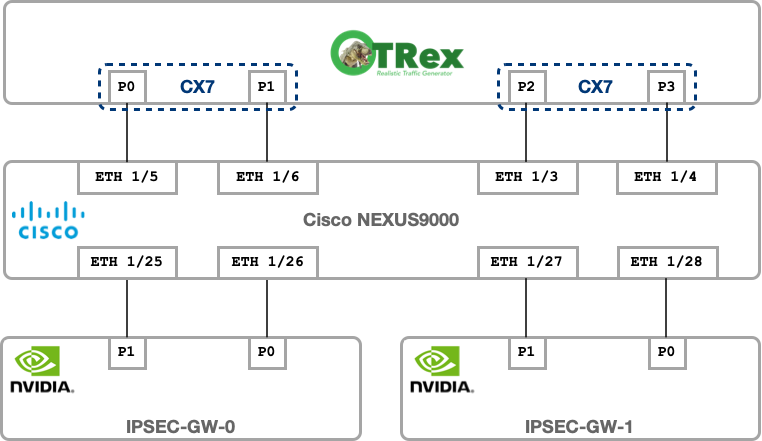</p>
TRex node is running CX7 100Gbps NICs

## iMIX tables

To rely on realistic traffic pattern, live mobile network has been analyzed to create
following iMIX table. These iMIX tables will be used in all our test scenarios :

=== "iMIX 1"
	| Packet Size | pps   |
	| ----------- | ------|
        | 114         | 27991 | 
        | 200         | 5841  |
        | 491         | 1807  |
        | 1000        | 2488  |
        | 1428        | 6039  |

=== "iMIX 2"
	| Packet Size | pps   |
	| ----------- | ------|
        | 120         | 16960 | 
        | 218         | 9161  |
        | 438         | 2960  |
        | 1075        | 5619  |
        | 1398        | 56458 |

=== "iMIX 3"
	| Packet Size | pps   |
	| ----------- | ------|
        | 113         | 14171 | 
        | 208         | 3255  |
        | 477         | 1135  |
        | 994         | 2190  |
        | 1417        | 4741  |

=== "iMIX 4"
	| Packet Size | pps   |
	| ----------- | ------|
        | 112         | 7703  | 
        | 221         | 3320  |
        | 437         | 1527  |
        | 1034        | 3055  |
        | 1367        | 55815 |


## TRex runner

TRex traffic amplifiers (multipliers) use a linear scale traffic factor to
incrementally increase traffic. We have extended this concept to support steps
in traffic amplification. Steps provide fine-grained threshold detection. In all
of our tests, we will use 20 steps, where each step amplifies traffic every 10 seconds,
so each time we run a test, we have to wait 200s for it to complete.

Trex provides a client interface via its STL API. We have created a tool, called 'TRex 
runner', based on the TRex STL API to run tests and generate graphs as output results.
This tool supports traffic profile templating.

You can find [trex-runner on its GitHub repo].

TRex is configured and run using Layer3 flavor on a *AMD EPYC 7452 32-Core Processor* box :

``` title="TRex configuration file : /etc/trex_cfg.yaml"
- version: 2
  c: 15
  interfaces:
    - '81:00.0'
    - '81:00.1'
    - '41:00.0'
    - '41:00.1'
  port_info:
    - ip: 10.0.0.1
      default_gw: 10.0.0.254
    - ip: 11.0.0.1
      default_gw: 11.0.0.254
    - ip: 10.1.0.1
      default_gw: 10.1.0.254
    - ip: 11.1.0.1
      default_gw: 11.1.0.254

  platform:
      master_thread_id: 0
      latency_thread_id: 31
      dual_if:
        - socket: 0
          threads: [1,2,3,4,5,6,7,8,9,10,11,12,13,14,15]
        - socket: 0
          threads: [16,17,18,19,20,21,22,23,24,25,26,27,28,29,30]
```

  [trex-runner on its GitHub repo]: https://github.com/vincentbernat/trex-runner

## strongSwan conf template

On each BF3, strongSwan will be used in tunnel mode with a simple PSK configuration as follow :

``` title="strongSwan configuration file : swanctl.conf"
connections {
  BF-TO-BF {
        local_addrs  = 192.168.101.1
        remote_addrs = 192.168.101.2

        local {
                auth = psk
                id = bf-ipsecgw-0
        }
        remote {
                auth = psk
                id = bf-ipsecgw-1
        }

        children {
          bf {
                local_ts = 16.0.0.0/8
                remote_ts = 48.0.0.0/8
                esp_proposals = aes256gcm128-esn
                mode = tunnel
                policies_fwd_out = yes
                hw_offload = packet
          }
        }
        version = 2
        mobike = no
        reauth_time = 0
        proposals = aes256-sha256-modp2048
  }
}

secrets {
  ike-BF {
        id-1 = bf-ipsecgw-0
        id-2 = bf-ipsecgw-1
        secret = 'TopSecret'
  }
}
```

---

## **Test 0 - Linux Kernel**

The purpose of this test is to evaluate standard Linux IPsec performaces has it
comes out of the box using BF3 with and without HW offload. This test will not
use any fastSwan eBPF/XDP acceleration.

### LAB topology

This test will use uni-directional routing path where packets are transmited to
TRex P0, sent to DUT and then received on TRex P1. This test evaluate a single
IPsec routing path which display accurate limit. We defined our DUT by exposing
IPsec features back-to-back (TX on IPSEC-GW-0/P0 & RX on IPSEC-GW-1/P1) :
<p style="text-align: center">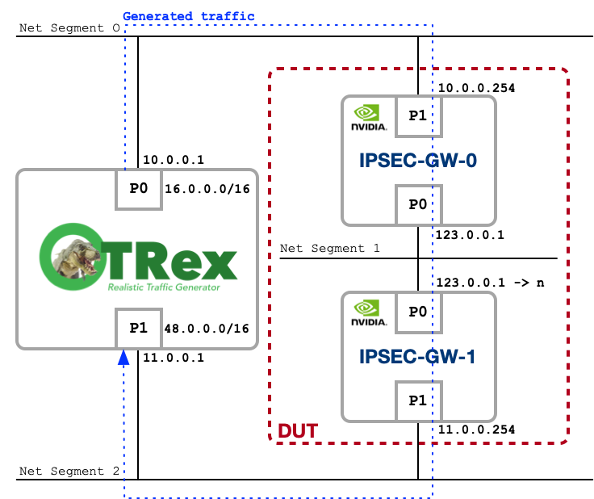</p>

IPsec Tunnels will be established on P0 port between both IPSEC-GW. Subnet 123.0.0.0/16
will be used to setup tunnel endpoints.

### Configurations

On each IPSEC-GW a script will generate routing and strongSwan configurations :

=== "IPSEC-GW-0: routings "
	```
	#!/bin/bash

	TNLCOUNT=<TNLCNT>

	#
	#	Networking setup
	#
	sysctl -w net.ipv4.ip_forward=1

	ip link set p0 up
	ip a a 123.0.0.1/16 dev p0

	ip link set p1 up
	ip a a 10.0.0.254/24 dev p1

	ip r a 16.0.0.0/8 via 10.0.0.1

	ip link set dev dummy0 up
	ip a a 10.10.10.10/32 dev dummy0
	ip r a default via 10.10.10.10

	#
	#	strongSwan initiate
	#
	ipsec start
	sleep 1
	swanctl --load-all

	for i in `seq 1 $TNLCOUNT`;
	do
		swanctl -i --child tnl$i
	done
	```

=== "IPSEC-GW-0: strongSwan "
	```
	#!/bin/bash

	if [ "$#" -ne 1 ]; then
	        echo "  "$(basename $0)" <tnlcount>"
	        echo "     tnlcount: NUMBER "
	        echo "                                "
	        echo " Generate strongSwan configuration files."
	        exit
	fi

	TNLCOUNT=$1
	SUBNET_CONNECTED="123.0"
	SUBNET_ROUTED_LOCAL="16"
	SUBNET_ROUTED_REMOTE="48"
	BITS="24"
	OUTPUT="s0-$TNLCOUNT.conf"

	if [ $TNLCOUNT -gt $((255 * 255)) ]; then
	        echo "Maximum tunnel supported : $((255 * 255))"
	        exit
	fi

	cat << HEADER > "$OUTPUT"
	connections {
	HEADER

	for i in `seq 1 $TNLCOUNT`
	do
	        cat << TNL >> "$OUTPUT"
	  tunnel$i {
		local_addrs  = ${SUBNET_CONNECTED}.0.1
		remote_addrs = ${SUBNET_CONNECTED}.$((i / 255)).$((i % 255 + 1))
	 
		local {
			auth = psk
			id = ipsecgw-0
		}
		remote {
			auth = psk
			id = ipsecgw-$i
		}
	 
		children {
		  tnl$i {
			local_ts = ${SUBNET_ROUTED_LOCAL}.0.0.0/8
			remote_ts = ${SUBNET_ROUTED_REMOTE}.$(((i-1) / 255)).$(((i-1) % 255)).0/${BITS}
			esp_proposals = aes256gcm128-esn
			mode = tunnel
			policies_fwd_out = yes
			hw_offload = packet
		  }
		}
		version = 2
		mobike = no
		reauth_time = 0
		proposals = aes256-sha256-modp2048
	  }
	TNL
	done

	cat << FOOTER >> "$OUTPUT"
	}

	secrets {
	FOOTER

	for i in `seq 1 $TNLCOUNT`
	do
	        cat << SECRET >> "$OUTPUT"
	  ike-tnl$i {
		id-1 = ipsecgw-0
		id-2 = ipsecgw-$i
		secret = 'TopSecret'
	  }
	SECRET
	done

	echo "}" >> "$OUTPUT"

	```

=== "IPSEC-GW-1: routings "
	```
	#!/bin/bash

	TNLCOUNT=<TNLCNT>

	#
	#       Networking setup
	#
	sysctl -w net.ipv4.ip_forward=1

	ip link set p0 up
	for i in `seq 1 $TNLCOUNT`;
	do
		ip a a 123.0.$((i / 255)).$((i % 255 + 1))/16 dev p0
	done

	ip link set p1 up
	ip a a 11.0.0.254/24 dev p1

	ip r a 48.0.0.0/8 via 11.0.0.1

	ip link set dev dummy0 up
	ip a a 10.10.10.10/32 dev dummy0
	ip r a default via 10.10.10.10

	#
	#       strongSwan initiate
	#
	ipsec start
	sleep 1
	swanctl --load-all
	```

=== "IPSEC-GW-1: strongSwan "
	```
	#!/bin/bash
	#
	#	120K Clients considered : adapt BITS to distribute load across
	#	24 : 254
	#	25 : 126
	#	....

	if [ "$#" -ne 1 ]; then
	        echo "  "$(basename $0)" <tnlcount>"
	        echo "     tnlcount: NUMBER "
	        echo "                                "
	        echo " Generate strongSwan configuration files."
	        exit
	fi

	TNLCOUNT=$1
	SUBNET_CONNECTED="123.0"
	SUBNET_ROUTED_LOCAL="48"
	SUBNET_ROUTED_REMOTE="16"
	BITS="24"
	OUTPUT="s1-$TNLCOUNT.conf"

	if [ $TNLCOUNT -gt $((255 * 255)) ]; then
		echo "Maximum tunnel supported : $((255 * 255))"
		exit
	fi

	cat << HEADER > "$OUTPUT"
	connections {
	HEADER

	for i in `seq 1 $TNLCOUNT`
	do
	        cat << TNL >> "$OUTPUT"
	  tunnel$i {
		remote_addrs  = ${SUBNET_CONNECTED}.0.1
		local_addrs = ${SUBNET_CONNECTED}.$((i / 255)).$((i % 255 + 1))
	 
		local {
			auth = psk
			id = ipsecgw-$i
		}
		remote {
			auth = psk
			id = ipsecgw-0
		}
	 
		children {
		  tnl$i {
			local_ts = ${SUBNET_ROUTED_LOCAL}.$(((i-1) / 255)).$(((i-1) % 255)).0/${BITS}
			remote_ts = ${SUBNET_ROUTED_REMOTE}.0.0.0/8
			esp_proposals = aes256gcm128-esn
			mode = tunnel
			policies_fwd_out = yes
			hw_offload = packet
		  }
		}
		version = 2
		mobike = no
		reauth_time = 0
		proposals = aes256-sha256-modp2048
	  }
	TNL
	done

	cat << FOOTER >> "$OUTPUT"
	}

	secrets {
	FOOTER

	for i in `seq 1 $TNLCOUNT`
	do
	        cat << SECRET >> "$OUTPUT"
	  ike-tnl$i {
		id-1 = ipsecgw-$i
		id-2 = ipsecgw-0
		secret = 'TopSecret'
	  }
	SECRET
	done

	echo "}" >> "$OUTPUT"
	```

### Results
<p style="text-align: center">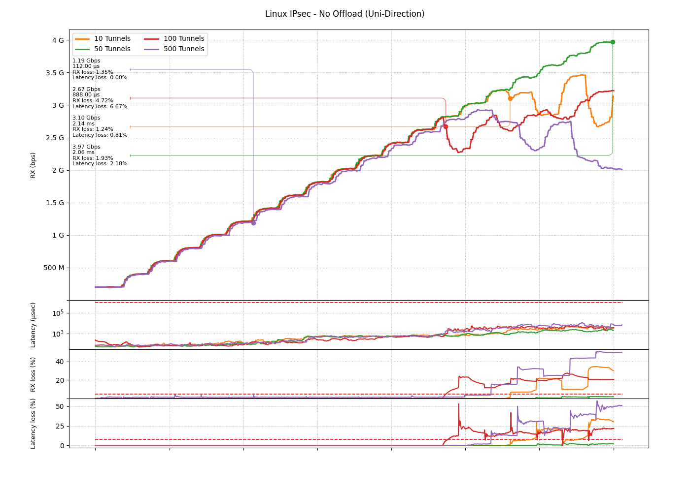</p>
<p style="text-align: center">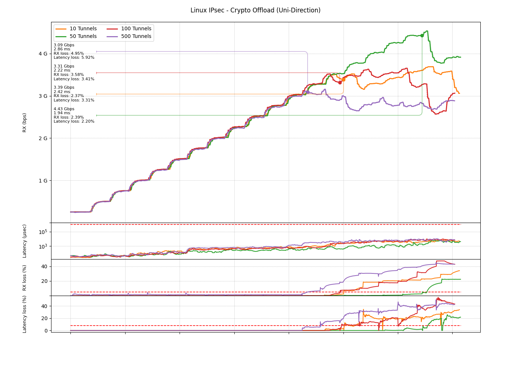</p>
<p style="text-align: center">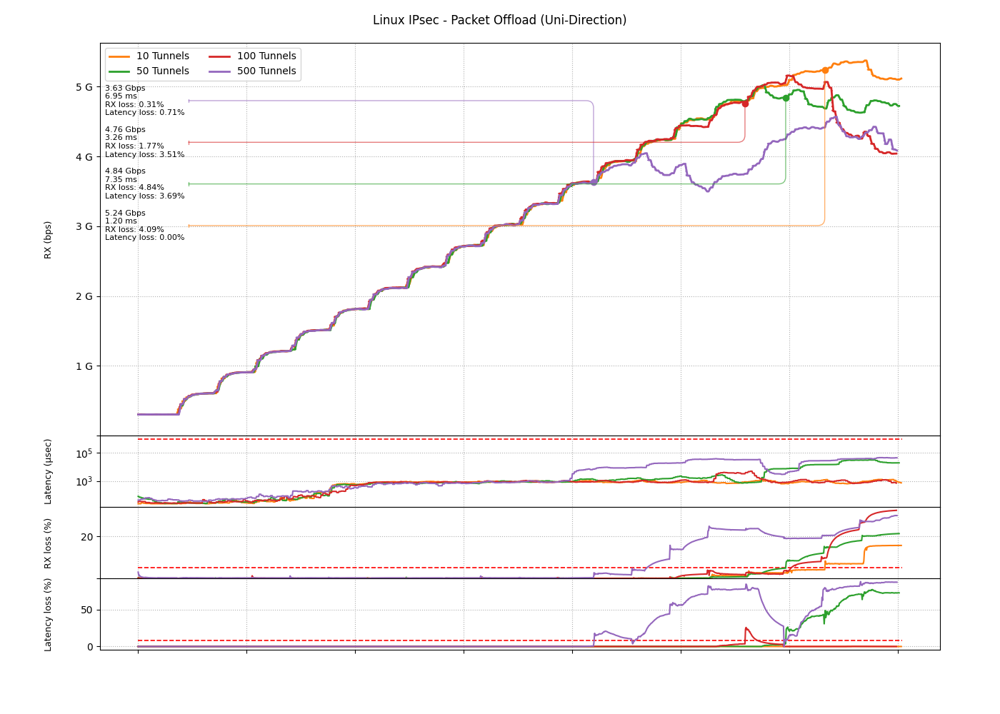</p>

### Discussion

Graphs above refer to specific Linux Kernel IPsec operations :

* **No Offload**: Linux Kernel XFRM layer will handle packet ciphering and packet
  encapsulation.
* **Crypto Offload**: Linux Kernel XFRM layer will only handle packet encapsulation, ciphering
  operations avec offloaded to BF3.
* **Packet Offload**: Both packet ciphering and encapsulation are offloaded to BF3.

Packet Offload is the most advanced Offload mode and we could expect a more important
performances gap between 2 others mode. The reason for that is that packets are
received on port P0 and sent to port P1, which means that we are relying on Linux
Kernel forwarding path to route packet in the network stack. In Packet Offload for
Tunnel mode, XFRM layer is [sending packets directly to netdevice] withtout the need
to recirculate packet inside netstack.

We can observe that traffic generated in 50 Tunnels outperforms traffic generated in 
10 Tunnels. This is only observed in *No Offload* and *Crypto Offload* mode. This
sounds weird, and re-tested 3 times, probably something to investigate at XFRM output
since we dont have this behaviour in *Packet Offload* mode where a direct netdevice
output take place.

The number of Tunnels is directly impacting performances with more latency impact in
*No Offload* mode.

  [sending packets directly to netdevice]: https://fastswan.org/kernel-patches/0010-xfrm-fix-tunnel-mode-TX-datapath-in-packet-offload-m.patch

---

## **Test 1 - fastSwan XDP**

The purpose of this test is to evaluate the fastSwan eBPF/XDP feature set and its impact
on data-path performance. This test uses the same LAB configuration as the one of
Test 0 where 500 IPsec Tunnels are used. Test 0 is completed by a bi-directional test.

fastSwan eBPF/XDP program uses BPF LPM matching, FIB lookup and packet redirection. We
are testing incremental features addition.

All testing is done in **Packet Offload** mode as this is our production target.

### LAB Topology
Same as Test 0, but adding a second path for bi-directional test.
<p style="text-align: center">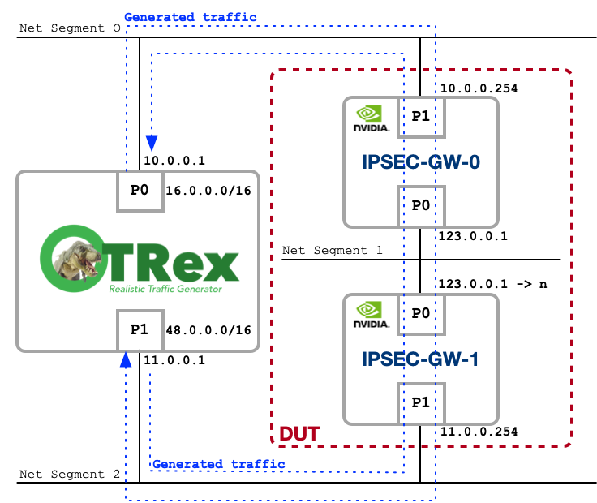</p>

### Configurations
Same as Test 0

### Results
<p style="text-align: center">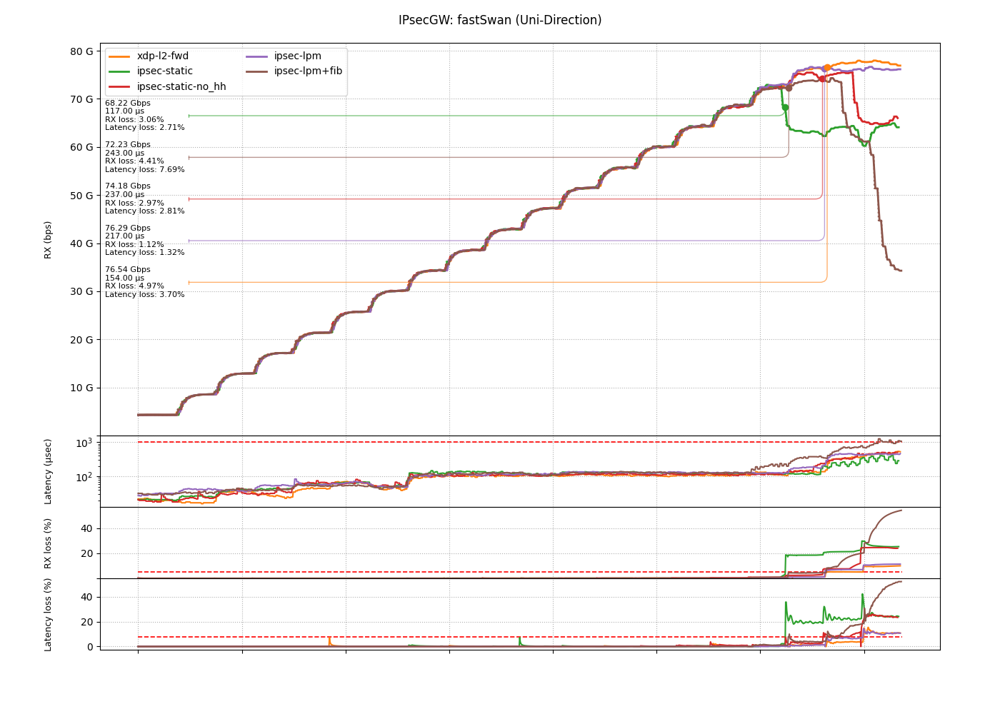</p>
<p style="text-align: center">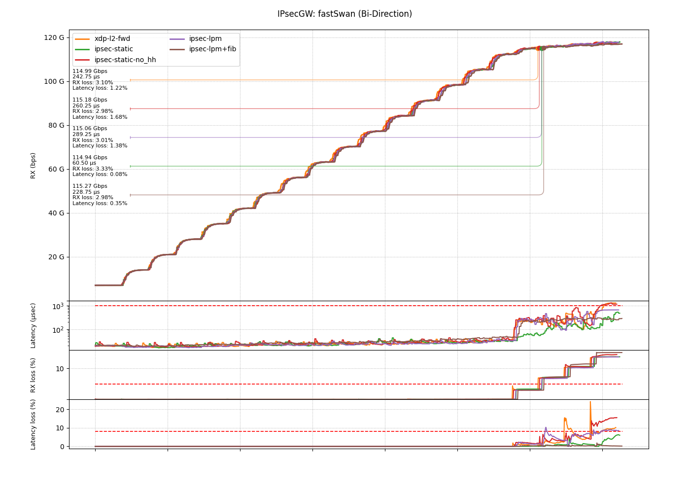</p>

### Discussion

Graph above refers to fastSwan eBPF/XDP split features:

* **xdp-l2-fwd**: Without any IPsec into the picture, just a pure and basic
  Layer2 forwarding between PO & P1 where eBPF program is simply rewriting
  ethernet header and redirecting packet to NIC. This is our reference for
  maximum throughput.

* **ipsec-static**: Same as xdp-l2-fwd but with traffic IPsec traffic.

* **ipsec-static-no_hh**: In Packet offload, each IPsec tunnels are initialized
  with Layer2 MAC addresses. This is same as ipsec-static but without setting
  MAC addresses for traffic redirected into IPsec tunnels.

* **ipsec-lpm**: Adding XFRM policy matching via BPF LPM to ipsec-static-no_hh.

* **ipsec-lpm+fib**: Adding BPF FIB lookup to ipsec-lpm. Ethernet header for packets
  not related to IPsec tunnels endpoint are built with BPF FIB lookup.

There is less performances if we are building ethernet header in all cases. For
packet redirected to IPsec interfaces simply skip ethernet header setup in eBPF
program.

Every feature used came at a cost, but considering the traffic pattern, the differences
between each BPF atomic features are quite negligible... Which is really impressive !!!
Same consideration on latency front.

Globally, a 4Gbps impact is observed using the full BPF feature set, which is a
global penalty of about 5.6%. This is acceptable considering the global numbers.

For bi-directional test results, TRex displays the cumulative RX for both ports on
the same graph. Curve convergence at peak perf is due to mutual cumulative perf impact
on {RX; TX} of CX7 IPsec offload and XDP forwarding. It provides the maximum perf for
the use-case where P1 is used for unciphered traffic and P0 for ciphered traffic, and
XDP is used to forward/route traffic between interfaces.

---

## **Test 2 - fastSwan mod Clients**

The purpose of this test is to evaluate impact of number of clients per IPsec Tunnels
for Bi-Directional use-case. This is the same as Test 1 but modulating number of
clients over 500 IPsec Tunnels.

Again : **Packet Offload** mode

### LAB Topology
Same as Test 1.

### Configurations
Same as Test 1.

### Results
<p style="text-align: center">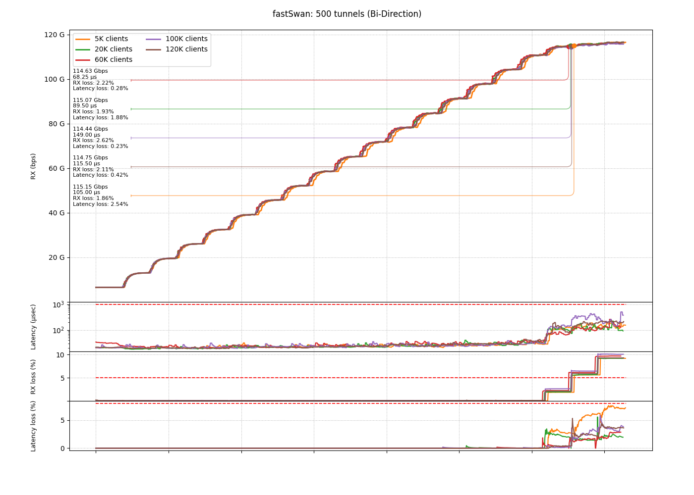</p>

### Discussion

Nothing more to say except that the impacts are negligible.

---

## **Test 3 - fastSwan mod Tunnels**

The purpose of this test is to evaluate impact of number of IPsec Tunnels for
Bi-Directional use-case. This is the same as Test 2 but dsitributing 120K Clients over
a modulating number of IPsec Tunnels.

Again : **Packet Offload** mode

### LAB Topology
Same as Test 2.

### Configurations
Same as Test 2.

### Results
<p style="text-align: center">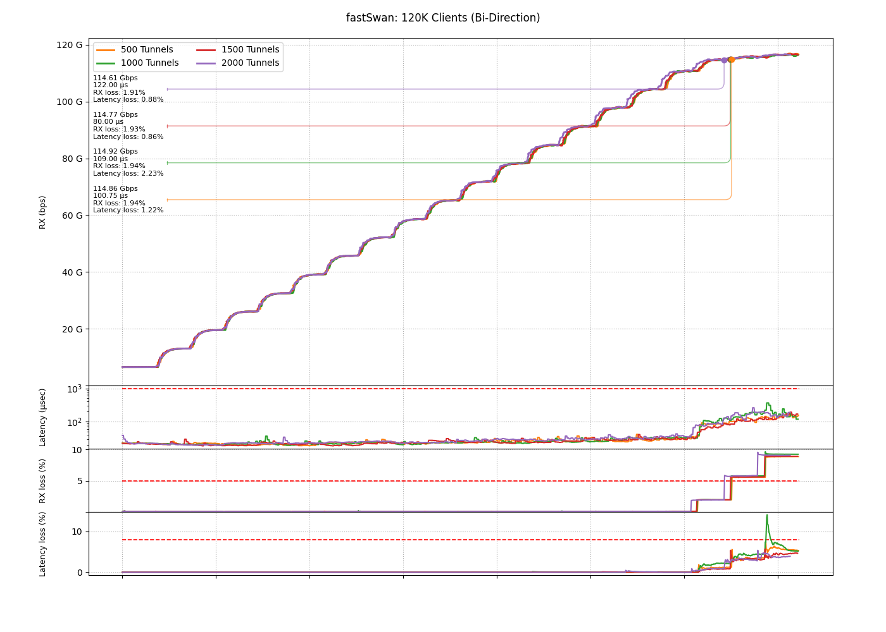</p>

### Discussion

Nothing more to say except that the impacts are negligible.

---

## **Test 4 - fastSwan Routed**

The purpose of this test is to evaluate global performances of the solution over
a network architecture as found on large scale Telco networks. We will use both
ports of BF3 for IPsec traffic. Each ports will define a VLAN interface for
unciphered traffic and native interface for IPsec ciphered traffic. As for Test3
TRex will distribute 120K Clients over a modulating number of IPsec Tunnels.

Again : **Packet Offload** mode

### LAB Topology
We are using IPSEC-GW in a Routed Network. Please refer to documentation
on [Routed Network] for split down architecture and details.

Logical Topology :
<p style="text-align: center">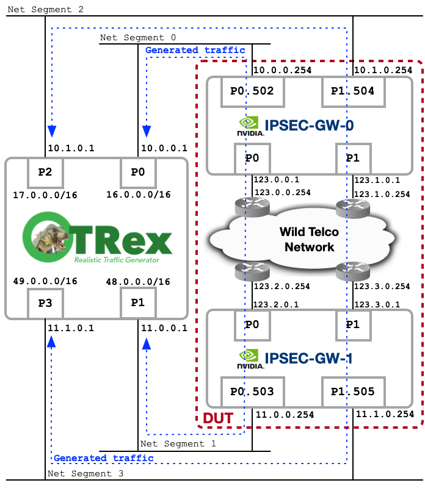</p>

Physical Topology :
<p style="text-align: center"></p>

  [Routed Network]: https://www.fastswan.org/IPsecGW-Sample/Routed-Network/

### Configurations
On each IPSEC-GW a script will generate routing and strongSwan configurations :

=== "IPSEC-GW-0: routings"
	```
	#!/bin/bash

	TNLCOUNT=<TNLCNT>

	#
	#       Networking setup
	#
	sysctl -w net.ipv4.ip_forward=1

	ip link set p0 up
	ip link add link p0 name p0.502 type vlan id 502
	ip link set dev p0.502 up
	ip a a 123.0.0.1/16 dev p0
	ip a a 10.0.0.254/24 dev p0.502

	ip link set p1 up
	ip link add link p1 name p1.504 type vlan id 504
	ip link set dev p1.504 up
	ip a a 123.1.0.1/16 dev p1
	ip a a 10.1.0.254/24 dev p1.504

	ip r a 123.2.0.0/16 via 123.0.0.254
	ip r a 123.3.0.0/16 via 123.1.0.254

	ip r a 16.0.0.0/8 via 10.0.0.1
	ip r a 17.0.0.0/8 via 10.1.0.1
	ip r a 48.0.0.0/8 via 123.0.0.254
	ip r a 49.0.0.0/8 via 123.1.0.254

	ip link set dev dummy0 up
	ip a a 10.10.10.10/32 dev dummy0
	ip r a default via 10.10.10.10

	#
	#       strongSwan initiate
	#
	ipsec start
	sleep 1
	swanctl --load-all

	for i in `seq 1 $TNLCOUNT`; do
		echo $i;
		swanctl -i --child tnl-0-$i > /dev/null;
		swanctl -i --child tnl-1-$i > /dev/null;
	done

	fastswan
	```

=== "IPSEC-GW-1: routings"
	```
	#!/bin/bash

	TNLCOUNT=<TNLCNT> 

	#
	#       Networking setup
	#
	sysctl -w net.ipv4.ip_forward=1 
	ip link set p0 up
	ip link add link p0 name p0.503 type vlan id 503
	ip link set dev p0.503 up
	for i in `seq 1 $TNLCOUNT`;
	do
	        ip a a 123.2.$((i / 255 + 1)).$((i % 255 + 1))/16 dev p0

	        # First Packet on Nexus9000 is dropped, force MAC learning
	        ping -q -w 1 -I 123.2.$((i / 255 + 1)).$((i % 255 + 1)) 123.2.0.254 > /dev/null &
	done
	ip a a 11.0.0.254/24 dev p0.503

	ip link set p1 up
	ip link add link p1 name p1.505 type vlan id 505
	ip link set dev p1.505 up
	for i in `seq 1 $TNLCOUNT`;
	do
	        ip a a 123.3.$((i / 255 + 1)).$((i % 255 + 1))/16 dev p1

	        # First Packet on Nexus9000 is dropped, force MAC learning
	        ping -q -w 1 -I 123.3.$((i / 255 + 1)).$((i % 255 + 1)) 123.3.0.254 > /dev/null &
	done
	ip a a 11.1.0.254/24 dev p1.505

	ip a a 123.2.0.1/16 dev p0
	ip a a 123.3.0.1/16 dev p1

	ip r a 123.0.0.0/16 via 123.2.0.254
	ip r a 123.1.0.0/16 via 123.3.0.254

	ip r a 48.0.0.0/8 via 11.0.0.1
	ip r a 49.0.0.0/8 via 11.1.0.1
	ip r a 16.0.0.0/8 via 123.0.0.254
	ip r a 17.0.0.0/8 via 123.1.0.254

	ip link set dev dummy0 up
	ip a a 10.10.10.10/32 dev dummy0
	ip r a default via 10.10.10.10

	#
	#       strongSwan initiate
	#
	ipsec start
	sleep 1
	swanctl --load-all

	fastswan
	```

=== "IPSEC-GW-0: gen-swanctl-P0"
	```
	#!/bin/bash

	if [ "$#" -ne 1 ]; then
	        echo "  "$(basename $0)" <tnlcount>"
	        echo "     tnlcount: NUMBER "
	        echo "                                "
	        echo " Generate strongSwan configuration files."
	        exit
	fi

	TNLCOUNT=$1
	SUBNET_CONNECTED="123"
	SUBNET_ROUTED_LOCAL="16"
	SUBNET_ROUTED_REMOTE="48"
	BITS="24"
	OUTPUT="s0-0-$TNLCOUNT.conf"

	if [ $TNLCOUNT -gt $((255 * 255)) ]; then
	        echo "Maximum tunnel supported : $((255 * 255))"
	        exit
	fi

	cat << HEADER > "$OUTPUT"
	connections {
	HEADER

	for i in `seq 1 $TNLCOUNT`
	do
	        cat << TNL >> "$OUTPUT"
	  tunnel-0-$i {
		local_addrs  = ${SUBNET_CONNECTED}.0.0.1
		remote_addrs = ${SUBNET_CONNECTED}.2.$((i / 255 + 1)).$((i % 255 + 1))
	 
		local {
			auth = psk
			id = ipsecgw-0
		}
		remote {
			auth = psk
			id = ipsecgw-$i
		}
	 
		children {
		  tnl-0-$i {
			local_ts = ${SUBNET_ROUTED_LOCAL}.0.0.0/8
			remote_ts = ${SUBNET_ROUTED_REMOTE}.$(((i-1) / 255)).$(((i-1) % 255)).0/${BITS}
			esp_proposals = aes256gcm128-esn
			mode = tunnel
			policies_fwd_out = yes
			hw_offload = packet
		  }
		}
		version = 2
		mobike = no
		reauth_time = 0
		proposals = aes256-sha256-modp2048
	  }
	TNL
	done

	cat << FOOTER >> "$OUTPUT"
	}

	secrets {
	FOOTER

	for i in `seq 1 $TNLCOUNT`
	do
	        cat << SECRET >> "$OUTPUT"
	  ike-tnl-0-$i {
		id-1 = ipsecgw-0
		id-2 = ipsecgw-$i
		secret = 'TopSecret'
	  }
	SECRET
	done

	echo "}" >> "$OUTPUT"
	```

=== "IPSEC-GW-0: gen-swanctl-P1"
	```
	#!/bin/bash

	if [ "$#" -ne 1 ]; then
	        echo "  "$(basename $0)" <tnlcount>"
	        echo "     tnlcount: NUMBER "
	        echo "                                "
	        echo " Generate strongSwan configuration files."
	        exit
	fi

	TNLCOUNT=$1
	SUBNET_CONNECTED="123"
	SUBNET_ROUTED_LOCAL="17"
	SUBNET_ROUTED_REMOTE="49"
	BITS="24"
	OUTPUT="s0-1-$TNLCOUNT.conf"

	if [ $TNLCOUNT -gt $((255 * 255)) ]; then
	        echo "Maximum tunnel supported : $((255 * 255))"
	        exit
	fi

	cat << HEADER > "$OUTPUT"
	connections {
	HEADER

	for i in `seq 1 $TNLCOUNT`
	do
	        cat << TNL >> "$OUTPUT"
	  tunnel-1-$i {
		local_addrs  = ${SUBNET_CONNECTED}.1.0.1
		remote_addrs = ${SUBNET_CONNECTED}.3.$((i / 255 + 1)).$((i % 255 + 1))
	 
		local {
			auth = psk
			id = ipsecgw-0
		}
		remote {
			auth = psk
			id = ipsecgw-$i
		}
	 
		children {
		  tnl-1-$i {
			local_ts = ${SUBNET_ROUTED_LOCAL}.0.0.0/8
			remote_ts = ${SUBNET_ROUTED_REMOTE}.$(((i-1) / 255)).$(((i-1) % 255)).0/${BITS}
			esp_proposals = aes256gcm128-esn
			mode = tunnel
			policies_fwd_out = yes
			hw_offload = packet
		  }
		}
		version = 2
		mobike = no
		reauth_time = 0
		proposals = aes256-sha256-modp2048
	  }
	TNL
	done

	cat << FOOTER >> "$OUTPUT"
	}

	secrets {
	FOOTER

	for i in `seq 1 $TNLCOUNT`
	do
	        cat << SECRET >> "$OUTPUT"
	  ike-tnl-1-$i {
		id-1 = ipsecgw-0
		id-2 = ipsecgw-$i
		secret = 'TopSecret'
	  }
	SECRET
	done

	echo "}" >> "$OUTPUT"
	```

=== "IPSEC-GW-1: gen-swanctl-P0"
	```
	#!/bin/bash
	#
	#	120K Clients considered : adapt BITS to distribute load across
	#	24 : 254
	#	25 : 126
	#	....

	if [ "$#" -ne 1 ]; then
	        echo "  "$(basename $0)" <tnlcount>"
	        echo "     tnlcount: NUMBER "
	        echo "                                "
	        echo " Generate strongSwan configuration files."
	        exit
	fi

	TNLCOUNT=$1
	SUBNET_CONNECTED="123"
	SUBNET_ROUTED_LOCAL="48"
	SUBNET_ROUTED_REMOTE="16"
	BITS="24"
	OUTPUT="s1-0-$TNLCOUNT.conf"

	if [ $TNLCOUNT -gt $((255 * 255)) ]; then
		echo "Maximum tunnel supported : $((255 * 255))"
		exit
	fi

	cat << HEADER > "$OUTPUT"
	connections {
	HEADER

	for i in `seq 1 $TNLCOUNT`
	do
	        cat << TNL >> "$OUTPUT"
	  tunnel-0-$i {
		remote_addrs  = ${SUBNET_CONNECTED}.0.0.1
		local_addrs = ${SUBNET_CONNECTED}.2.$((i / 255 + 1)).$((i % 255 + 1))
	 
		local {
			auth = psk
			id = ipsecgw-$i
		}
		remote {
			auth = psk
			id = ipsecgw-0
		}
	 
		children {
		  tnl-0-$i {
			local_ts = ${SUBNET_ROUTED_LOCAL}.$(((i-1) / 255)).$(((i-1) % 255)).0/${BITS}
			remote_ts = ${SUBNET_ROUTED_REMOTE}.0.0.0/8
			esp_proposals = aes256gcm128-esn
			mode = tunnel
			policies_fwd_out = yes
			hw_offload = packet
		  }
		}
		version = 2
		mobike = no
		reauth_time = 0
		proposals = aes256-sha256-modp2048
	  }
	TNL
	done

	cat << FOOTER >> "$OUTPUT"
	}

	secrets {
	FOOTER

	for i in `seq 1 $TNLCOUNT`
	do
	        cat << SECRET >> "$OUTPUT"
	  ike-tnl-0-$i {
		id-1 = ipsecgw-$i
		id-2 = ipsecgw-0
		secret = 'TopSecret'
	  }
	SECRET
	done

	echo "}" >> "$OUTPUT"
	```

=== "IPSEC-GW-1: gen-swanctl-P1"
	```
	#!/bin/bash
	#
	#	120K Clients considered : adapt BITS to distribute load across
	#	24 : 254
	#	25 : 126
	#	....

	if [ "$#" -ne 1 ]; then
	        echo "  "$(basename $0)" <tnlcount>"
	        echo "     tnlcount: NUMBER "
	        echo "                                "
	        echo " Generate strongSwan configuration files."
	        exit
	fi

	TNLCOUNT=$1
	SUBNET_CONNECTED="123"
	SUBNET_ROUTED_LOCAL="49"
	SUBNET_ROUTED_REMOTE="17"
	BITS="24"
	OUTPUT="s1-1-$TNLCOUNT.conf"

	if [ $TNLCOUNT -gt $((255 * 255)) ]; then
		echo "Maximum tunnel supported : $((255 * 255))"
		exit
	fi

	cat << HEADER > "$OUTPUT"
	connections {
	HEADER

	for i in `seq 1 $TNLCOUNT`
	do
	        cat << TNL >> "$OUTPUT"
	  tunnel-1-$i {
		remote_addrs  = ${SUBNET_CONNECTED}.1.0.1
		local_addrs = ${SUBNET_CONNECTED}.3.$((i / 255 + 1)).$((i % 255 + 1))
	 
		local {
			auth = psk
			id = ipsecgw-$i
		}
		remote {
			auth = psk
			id = ipsecgw-0
		}
	 
		children {
		  tnl-1-$i {
			local_ts = ${SUBNET_ROUTED_LOCAL}.$(((i-1) / 255)).$(((i-1) % 255)).0/${BITS}
			remote_ts = ${SUBNET_ROUTED_REMOTE}.0.0.0/8
			esp_proposals = aes256gcm128-esn
			mode = tunnel
			policies_fwd_out = yes
			hw_offload = packet
		  }
		}
		version = 2
		mobike = no
		reauth_time = 0
		proposals = aes256-sha256-modp2048
	  }
	TNL
	done

	cat << FOOTER >> "$OUTPUT"
	}

	secrets {
	FOOTER

	for i in `seq 1 $TNLCOUNT`
	do
	        cat << SECRET >> "$OUTPUT"
	  ike-tnl-1-$i {
		id-1 = ipsecgw-$i
		id-2 = ipsecgw-0
		secret = 'TopSecret'
	  }
	SECRET
	done

	echo "}" >> "$OUTPUT"
	```

In order to emulate **Wild Telco Network**, we can use the following configuration on a Cisco equipment. This configuration will define a VRF to introduce Layer3 routing :

``` title="Cisco Nexus9000 configuration"
vlan 502-513

vlan 502
  name trex_trusted_0
vlan 503
  name trex_trusted_1
vlan 504
  name trex_trusted_2
vlan 505
  name trex_trusted_3
vlan 510
  name trex_untrusted_p0_bf0
vlan 511
  name trex_untrusted_p1_bf0
vlan 512
  name trex_untrusted_p0_bf1
vlan 513
  name trex_untrusted_p1_bf1

interface Vlan510
  no shutdown
  vrf member trex_unencrypted
  no ip redirects
  ip address 123.0.0.254/16

interface Vlan511
  no shutdown
  vrf member trex_unencrypted
  no ip redirects
  ip address 123.1.0.254/16

interface Vlan512
  no shutdown
  vrf member trex_unencrypted
  no ip redirects
  ip address 123.2.0.254/16

interface Vlan513
  no shutdown
  vrf member trex_unencrypted
  ip address 123.3.0.254/16

vrf context trex_unencrypted
  ip route 16.0.0.0/8 123.0.0.1
  ip route 17.0.0.0/8 123.1.0.1
  ip route 48.0.0.0/8 123.2.0.1
  ip route 49.0.0.0/8 123.3.0.1

interface Ethernet1/25
  description IPSEC-GW-1-P1
  switchport
  switchport mode trunk
  switchport trunk native vlan 511
  switchport trunk allowed vlan 504,511
  no shutdown

interface Ethernet1/26
  description IPSEC-GW-1-P0
  switchport
  switchport mode trunk
  switchport trunk native vlan 510
  switchport trunk allowed vlan 502,510
  no shutdown

interface Ethernet1/27
  description IPSEC-GW-2-P1
  switchport
  switchport mode trunk
  switchport trunk native vlan 513
  switchport trunk allowed vlan 505,513
  no shutdown

interface Ethernet1/28
  description IPSEC-GW-2-P0
  switchport
  switchport mode trunk
  switchport trunk native vlan 512
  switchport trunk allowed vlan 503,512
  no shutdown
```


### Results
<p style="text-align: center">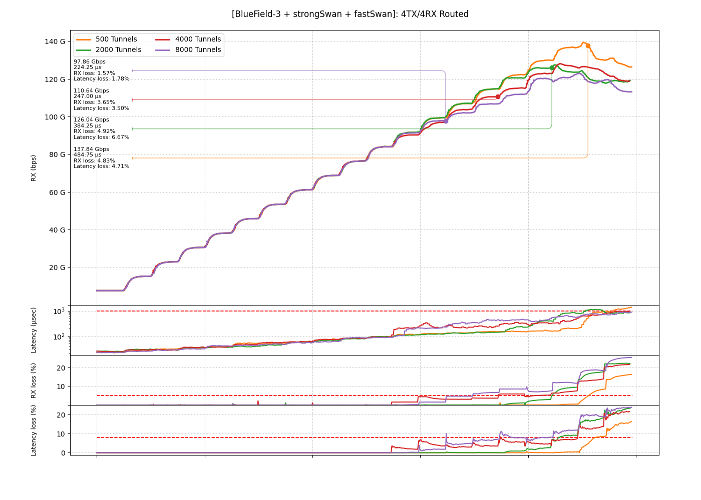</p>

### Discussion

Number of tunnels induces latency, but if your target for BF3 platform is around 2K tunnels then performances are very good and way better than any other competing solution.

As mentioned before, we MUST take into account that the designed DUT is the worst case scenario, where HW limits are hit twice on the data path. In a live network, the performance is expected to be even more impressive since the HW limits are hit once and CX7 can be run on a stronger CPU box to push even more. But, as always, the economic equation MUST drive the choice.
