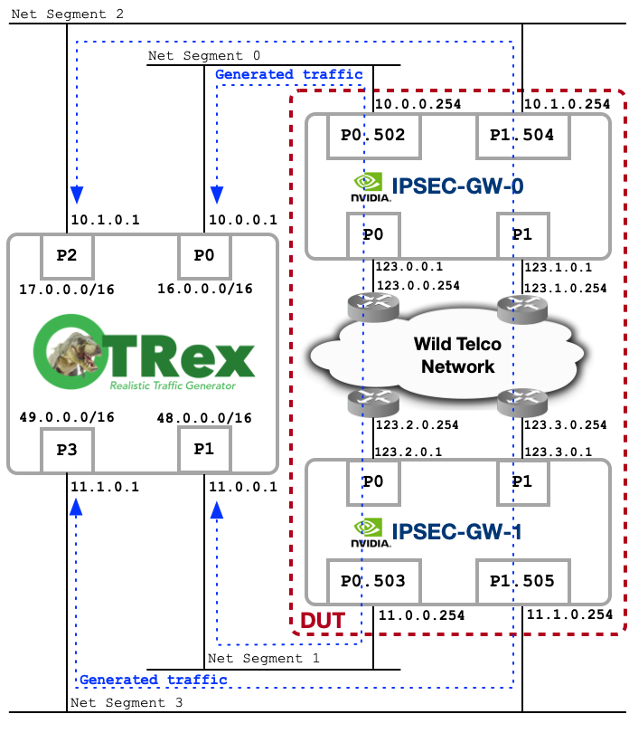
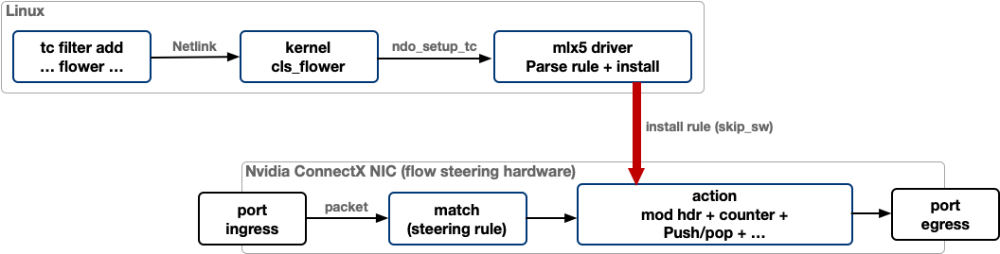
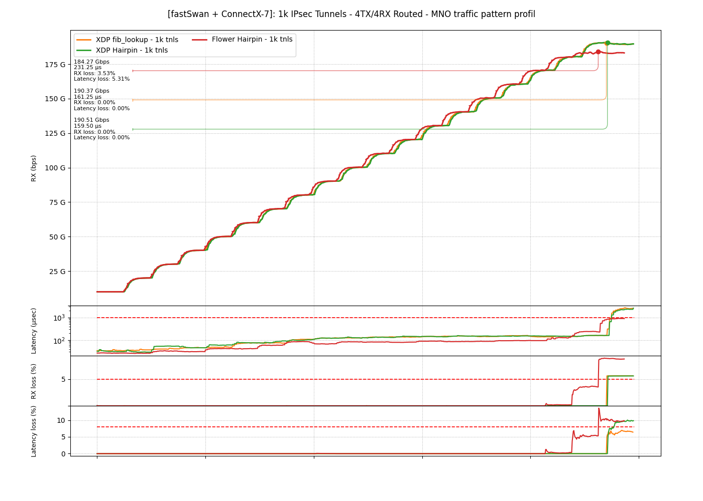
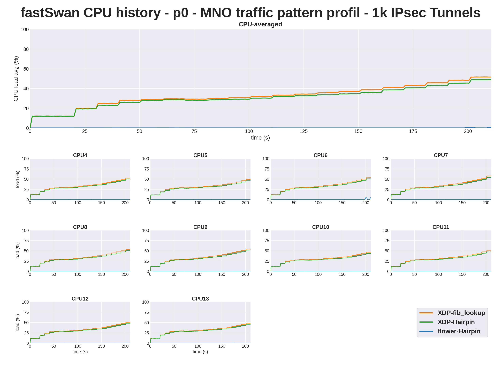
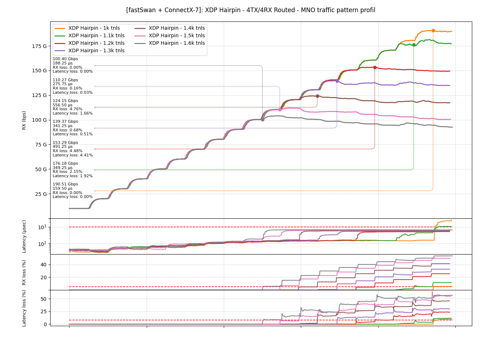
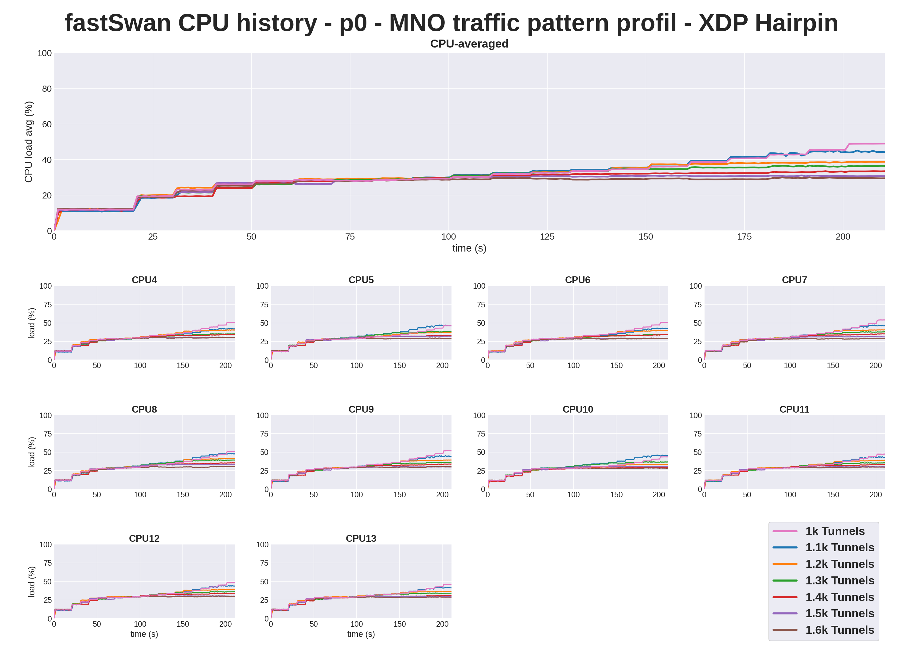
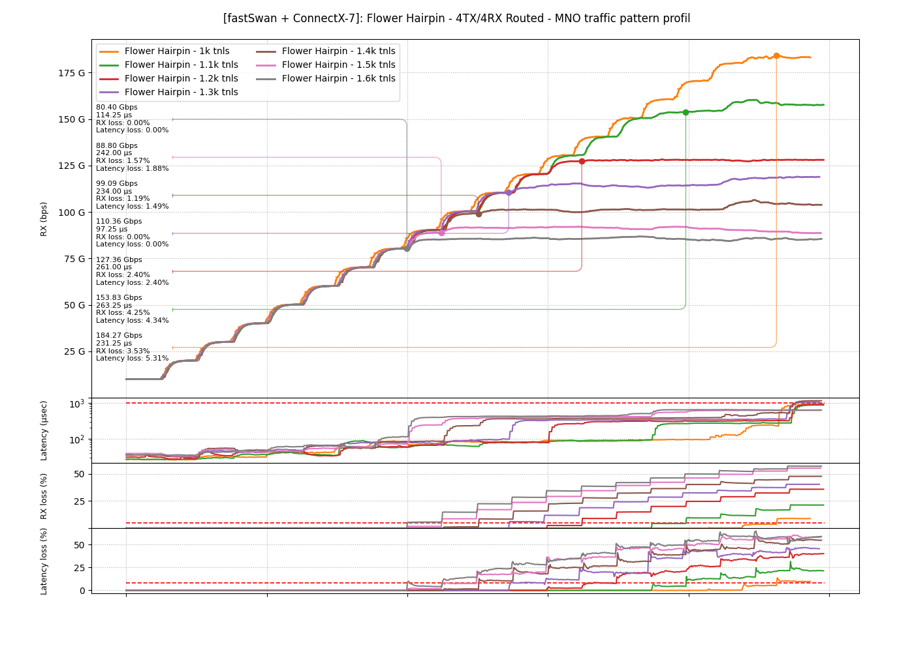
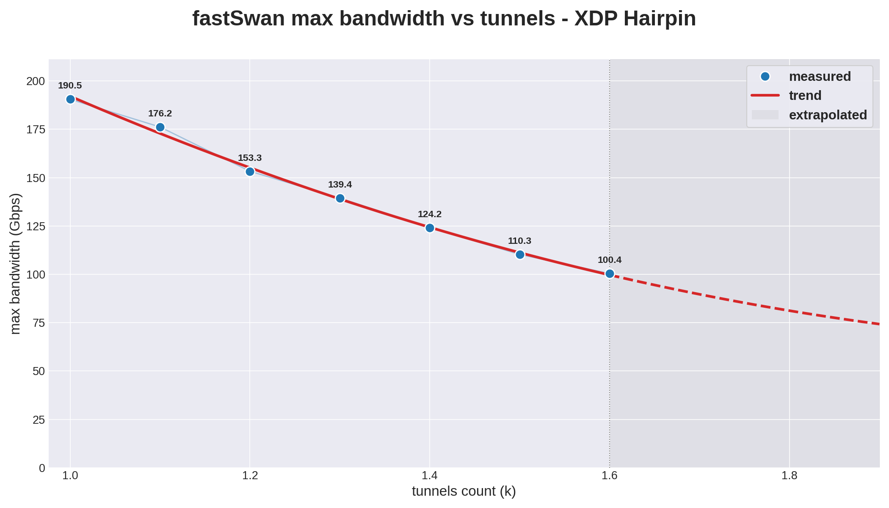
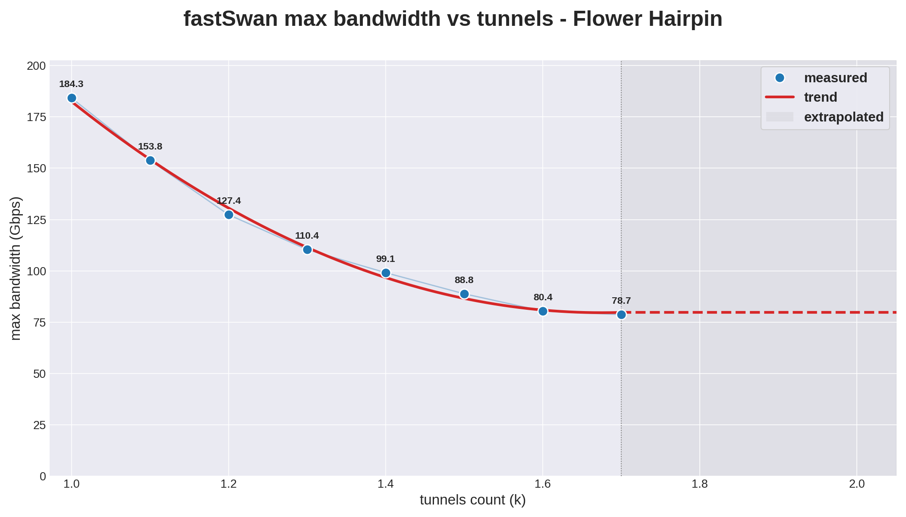
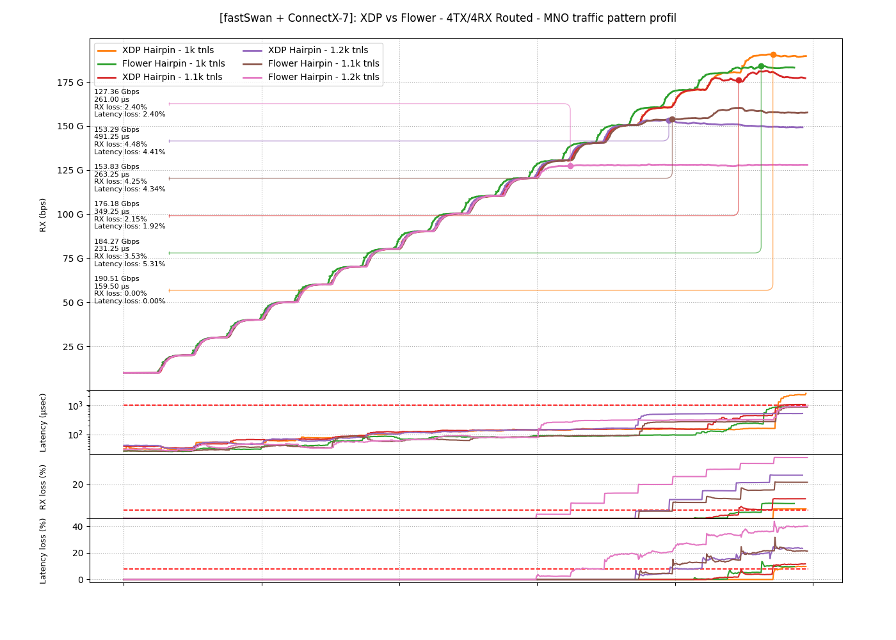

*Alexandre Cassen*, <<acassen@gmail.com>> | *Sebastien Hurtel*, <<sebastienhurtel@gmail.com>>

---

This article picks up where the [Nvidia Bluefield-3 by numbers] benchmark
left off. The DPU form factor gives an all-in-one box and a clean
deployment story, but a lot of telco operators run their own gateway
hardware and just want the NIC. We rerun the same protocol on a
standalone ConnectX-7 sitting in a regular x86 chassis. The
ConnectX-7 (CX7) is the chipset used by BF3. What changes is the
host.

The main goal here is twofold. First, benchmark the CX7 itself
under the same protocol as the BF3. Second, use tc flower to push
the forwarding path into the NIC. That second part turned into
a new forwarding model inside fastSwan named `flower-mode` (aka
`furious-mode`). Building it also required some adaptations to the
mlx5 kernel driver, sent as an RFC patchset to the Nvidia Linux
kernel team.

The DUT runs on the following hardware:

* CPU: Intel(R) Xeon(R) Gold 6342 @ 2.80 GHz, 2 sockets × 24 cores
  (48 cores total, no SMT), Ice Lake-SP, 36 MB L3 per socket,
  PCIe Gen4 x16
* Memory: 125 GB DDR4, 2 NUMA nodes (NUMA 0: CPUs 0-23, NUMA 1:
  CPUs 24-47)
* NIC: NVIDIA ConnectX-7 HHHL adapter card, 200 GbE / NDR200 IB,
  dual-port QSFP112, PCIe Gen5.0 x16 with x16 PCIe extension
  option, Crypto and Secure Boot enabled
* Part Number: MCX755106AC-HEA_Ax
* PSID: MT_0000001045
* Firmware: 28.48.1000 (release date 11.2.2026)
* PCI location used for the bench: 0000:31:00.0 (p0) and
  0000:31:00.1 (p1), NUMA node 0
* Kernel: Linux 7.0.10 PREEMPT_DYNAMIC, mlx5_core driver in
  NIC mode (legacy eswitch, no switchdev)
* Userland: strongSwan 6.0, fastSwan

  [Nvidia Bluefield-3 by numbers]: ../Nvidia-Bluefield-3-Benchmark/

## Typical benchmark testrun

The video below is a live testrun of the XDP fib_lookup scenario.

<p style="text-align: center">
  <iframe width="720" height="405"
    src="https://www.youtube.com/embed/7LuXF3kPTv4"
    title="XDP fib_lookup live testrun"
    frameborder="0"
    allow="accelerometer; autoplay; clipboard-write; encrypted-media; gyroscope; picture-in-picture"
    allowfullscreen></iframe>
</p>

## Network LAB topology

The lab is the same as Test 4 of the Bluefield-3 article. Each port
of the DUT carries both clear-text traffic and the IPsec carrier on
the same physical interface, where the clear-text side sits on an
802.1Q VLAN sub-interface and the IPsec ESP traffic rides the native
untagged interface. That layout matches a wild telco edge.

<p style="text-align: center"></p>

## System hardware and configuration

Three things matter for the host setup. CPU isolation keeps the
dataplane CPUs out of reach of the kernel scheduler, so the RX
queues never share their cycles with housekeeping work. NIC tuning
sets the RX rings, the RSS layout and the PCIe `MaxReadReq` to the
values that get the most out of the CX7 on this PCIe Gen4 platform.
fastSwan configuration enables `flower-outbound-mode`, `flower-inbound-mode`,
`flower-decrement-ttl` and `route-to-nexthop` on both physical
ports.

=== "Kernel cmdline"
	```
	BOOT_IMAGE=/boot/vmlinuz-7.0.10 root=UUID=... ro
	  intel_pstate=disable intel_iommu=on iommu=pt pci=realloc
	  default_hugepagesz=1G hugepagesz=1G hugepages=32
	  mitigations=off
	  isolcpus=managed_irq,domain,4-23
	  nohz_full=4-23 rcu_nocbs=4-23 rcu_nocb_poll
	  irqaffinity=0-3 kthread_cpus=0-3
	  intel_idle.max_cstate=1 processor.max_cstate=1
	  cpufreq.default_governor=performance
	  numa_balancing=disable transparent_hugepage=never
	  skew_tick=1 nmi_watchdog=0 nosoftlockup
	  clocksource=tsc tsc=reliable audit=0
	```

=== "setup-host.sh"
	```bash
    #!/usr/bin/env bash
    # CPU layout, NUMA 0 only (Package 0, CPUs 0-23):
    #   0-1		housekeeping (kernel, generic IRQs, services)
    #   2-3		fastSwan daemon + monitor pthread
    #   4-13	p0 (mlx5_0, PCI 0000:31:00.0) rx queues 0..9
    #   14-23	p1 (mlx5_1, PCI 0000:31:00.1) rx queues 0..9

    P0_IFACE=p0
    P1_IFACE=p1
    RXQ_COUNT=10
    P0_PCI=0000:31:00.0
    P1_PCI=0000:31:00.1
    P0_RXQ_CPUS=4-13
    P1_RXQ_CPUS=14-23

    log() {
            printf '[setup-host] %s\n' "$*"
    }

    expand_cpulist() {
            local IFS=,
            for part in $1; do
                    if [[ $part == *-* ]]; then
                            seq "${part%-*}" "${part#*-}"
                    else
                            echo "$part"
                    fi
            done
    }

    disable_thp() {
        log "disable transparent hugepages"
        local f
        for f in /sys/kernel/mm/transparent_hugepage/enabled \
             /sys/kernel/mm/transparent_hugepage/defrag; do
            [ -w "$f" ] && echo never > "$f"
        done
    }

    sysctl_tune() {
        log "apply sysctl tuning"
        sysctl -qw kernel.nmi_watchdog=0
        sysctl -qw net.core.bpf_jit_enable=1
        sysctl -qw net.core.bpf_jit_harden=0
        sysctl -qw net.ipv4.ip_forward=1
        sysctl -qw net.ipv6.conf.all.forwarding=1
        sysctl -qw net.ipv4.conf.all.rp_filter=0
        sysctl -qw net.ipv4.conf.default.rp_filter=0
        sysctl -qw net.core.busy_poll=50
        sysctl -qw net.core.busy_read=50
        sysctl -qw net.core.netdev_budget=600
        sysctl -qw net.core.netdev_budget_usecs=8000
    }

    tune_nic() {
            local dev=$1

            log "tune $dev"

            ethtool -K "$dev" gro off lro off gso off tso off
            ethtool -K "$dev" hw-tc-offload on ntuple on
            ethtool -G "$dev" rx 8192 tx 8192
            ethtool -C "$dev" adaptive-rx off adaptive-tx off
            ethtool -C "$dev" rx-usecs 8 rx-frames 64 tx-usecs 8
            ethtool -A "$dev" rx off tx off 2>/dev/null || true
            ethtool --set-priv-flags "$dev" rx_striding_rq on
            ethtool --set-priv-flags "$dev" rx_cqe_compress on
            ethtool -L "$dev" combined "$RXQ_COUNT"
            ethtool -X "$dev" equal "$RXQ_COUNT"
            ip link set "$dev" up
    }

    # Pin mlx5_compN IRQs by name from /proc/interrupts in queue order
    pin_mlx_rxqs() {
            local pci=$1
            local cpulist=$2
            local cpus
            cpus=( $(expand_cpulist "$cpulist") )

            local q irq cpu pat
            for ((q = 0; q < RXQ_COUNT; q++)); do
                    pat="mlx5_comp${q}@pci:${pci}"
                    irq=$(awk -v p="$pat" \
                            '$NF == p { sub(":","",$1); print $1 }' \
                            /proc/interrupts)
                    if [ -z "$irq" ]; then
                            log "pin: $pci comp$q IRQ not found"
                            continue
                    fi
                    cpu=${cpus[$q]}
                    log "pin: $pci comp$q (IRQ $irq) -> CPU $cpu"
                    echo "$cpu" > "/proc/irq/$irq/smp_affinity_list"
            done
    }

    # Bump PCIe MaxReadReq to 2048B
    set_pcie_mrrs() {
            local pci=$1
            local cur new
            cur=$(setpci -s "$pci" CAP_EXP+8.w)
            new=$(printf '%04x' $(( (0x$cur & 0x8fff) | 0x4000 )))
            setpci -s "$pci" CAP_EXP+8.w=$new
            log "pcie: $pci DevCtl 0x$cur -> 0x$new (MRRS=2048B)"
    }

    disable_thp
    sysctl_tune
    tune_nic "$P0_IFACE"
    tune_nic "$P1_IFACE"
    set_pcie_mrrs "$P0_PCI"
    set_pcie_mrrs "$P1_PCI"
    pin_mlx_rxqs "$P0_PCI" "$P0_RXQ_CPUS"
    pin_mlx_rxqs "$P1_PCI" "$P1_RXQ_CPUS"
    log "done"
	```

=== "mlxconfig tweaks"
	```bash
	# Inspect current values
	mlxconfig -d 0000:31:00.0 -e q
	mlxconfig -d 0000:31:00.1 -e q

	# Move hairpin data buffers into HCA SRAM
	mlxconfig -d 0000:31:00.0 set HAIRPIN_DATA_BUFFER_LOCK=True
	mlxconfig -d 0000:31:00.1 set HAIRPIN_DATA_BUFFER_LOCK=True

	# Enable the flex parser profile needed by the IPsec accel path
	mlxconfig -d 0000:31:00.0 set FLEX_PARSER_PROFILE_ENABLE=3
	mlxconfig -d 0000:31:00.1 set FLEX_PARSER_PROFILE_ENABLE=3

	# Apply the new config without a full reboot
	mlxfwreset -d 0000:31:00.0 -y reset
	mlxfwreset -d 0000:31:00.1 -y reset
	```

=== "IPSEC-GW-0: network.sh"
	```bash
	ip link set p0 up
	ip link add link p0 name p0.502 type vlan id 502
	ip link set dev p0.502 up
	ip a a 123.0.0.1/16 dev p0
	ip a a 10.0.0.254/24 dev p0.502

	ip link set p1 up
	ip link add link p1 name p1.504 type vlan id 504
	ip link set dev p1.504 up
	ip a a 123.1.0.1/16 dev p1
	ip a a 10.1.0.254/24 dev p1.504

	ip r a 123.2.0.0/16 via 123.0.0.254
	ip r a 123.3.0.0/16 via 123.1.0.254
	ip r a 16.0.0.0/8   via 10.0.0.1
	ip r a 17.0.0.0/8   via 10.1.0.1
	ip r a 48.0.0.0/8   via 123.0.0.254
	ip r a 49.0.0.0/8   via 123.1.0.254
	```

=== "IPSEC-GW-0: fastswan.conf"
	```
	hostname fastSwan
	!
	daemon-cpu 2-3
	daemon-priority 50
	lock-memory
	cpu-mask 0-23
	!
	bpf-program xdp-xfrm
	 path /etc/fastswan/xfrm_offload.bpf
	 no shutdown
	!
	interface p0
	 bpf-program xdp-xfrm
	 hairpin-to-nexthop 10.0.0.1
	 flower-inbound-mode
	 flower-outbound-mode
	 flower-decrement-ttl
	 no shutdown
	!
	interface p0.502
	 no shutdown
	!
	interface p1
	 bpf-program xdp-xfrm
	 hairpin-to-nexthop 10.1.0.1
	 flower-inbound-mode
	 flower-outbound-mode
	 flower-decrement-ttl
	 no shutdown
	!
	interface p1.504
	 no shutdown
	!
	load-existing-xfrm-policy
	!
	line vty
	 no login
	 listen unix owner fswan group fswan
	!
	```

=== "IPSEC-GW-1: network.sh"
	```bash
	ip link set p0 up
	ip link add link p0 name p0.503 type vlan id 503
	ip link set dev p0.503 up
	ip a a 123.2.0.1/16 dev p0
	ip a a 11.0.0.254/24 dev p0.503

	ip link set p1 up
	ip link add link p1 name p1.505 type vlan id 505
	ip link set dev p1.505 up
	ip a a 123.3.0.1/16 dev p1
	ip a a 11.1.0.254/24 dev p1.505

	ip r a 123.0.0.0/16 via 123.2.0.254
	ip r a 123.1.0.0/16 via 123.3.0.254
	ip r a 16.0.0.0/8   via 123.2.0.254
	ip r a 17.0.0.0/8   via 123.3.0.254
	ip r a 48.0.0.0/8   via 11.0.0.1
	ip r a 49.0.0.0/8   via 11.1.0.1
	```

=== "IPSEC-GW-1: fastswan.conf"
	```
	hostname fastSwan
	!
	daemon-cpu 2-3
	daemon-priority 50
	lock-memory
	cpu-mask 0-23
	!
	bpf-program xdp-xfrm
	 path /etc/fastswan/xfrm_offload.bpf
	 no shutdown
	!
	interface p0
	 bpf-program xdp-xfrm
	 hairpin-to-nexthop 11.0.0.1
	 flower-inbound-mode
	 flower-outbound-mode
	 flower-decrement-ttl
	 no shutdown
	!
	interface p0.503
	 no shutdown
	!
	interface p1
	 bpf-program xdp-xfrm
	 hairpin-to-nexthop 11.1.0.1
	 flower-inbound-mode
	 flower-outbound-mode
	 flower-decrement-ttl
	 no shutdown
	!
	interface p1.505
	 no shutdown
	!
	load-existing-xfrm-policy
	!
	line vty
	 no login
	 listen unix owner fswan group fswan
	!
	```

The kernel cmdline isolates CPUs 4-23 (`isolcpus`, `nohz_full`,
`rcu_nocbs`, `irqaffinity=0-3`) and clamps C-states at C1, so the
RX queues never lose cycles to housekeeping or deep idle. The
governor stays at performance and mitigations are off so the
absolute numbers do not get muddied by speculative-exec fences.

setup-host.sh disables transparent hugepages, turns off the
GRO/LRO/GSO/TSO offloads we do not want in front of XDP, enables
`hw-tc-offload`, lays out 10 RX queues per port, pins
each `mlx5_compN` IRQ on its dedicated CPU, and finally bumps the
PCIe `MaxReadReq` from 512 to 2048 bytes (DevCtl[14:12]). That
last bit buys roughly 6 Gbps per direction without exploding the
`rx_out_of_buffer` rate.

fastswan.conf declares one XDP program and binds it on p0 and p1,
then enables `flower-inbound-mode`, `flower-outbound-mode` and
`flower-decrement-ttl` on each. `hairpin-to-nexthop` pre-resolves the
LAN-side next hop once at warmup so the data path skips the kernel
FIB lookup, and `load-existing-xfrm-policy` replays the strongSwan
SAs at boot.

The mlxconfig tweaks move the hairpin data buffers into HCA SRAM
(`HAIRPIN_DATA_BUFFER_LOCK=True`) so cross-NIC hairpin traffic stays
off PCIe, and switch the flex parser to profile 3 so the IPsec accel
path lights up.

Once fastSwan is running, two VTY commands confirm the host layout
landed as planned. `show interface topology` walks the PCI tree and
shows the NUMA placement and driver for each ethernet device:

```
fastSwan> show interface topology
PCI ethernet topology
├── NUMA node 0
│   ├── 0000:31:00.0
│   │   ├── vendor: Mellanox Technologies [15b3]
│   │   ├── model:  MT2910 Family [ConnectX-7] [1021]
│   │   ├── driver: mlx5_core
│   │   └── net:    p0
│   ├── 0000:31:00.1
│   │   ├── vendor: Mellanox Technologies [15b3]
│   │   ├── model:  MT2910 Family [ConnectX-7] [1021]
│   │   ├── driver: mlx5_core
│   │   └── net:    p1
│   ├── 0000:4b:00.0
│   │   ├── vendor: Intel Corporation [8086]
│   │   ├── model:  I350 Gigabit Network Connection [1521]
│   │   ├── driver: igb
│   │   └── net:    enp75s0f0
│   └── 0000:4b:00.1
│       ├── vendor: Intel Corporation [8086]
│       ├── model:  I350 Gigabit Network Connection [1521]
│       ├── driver: igb
│       └── net:    enp75s0f1
└── NUMA node 1
    ├── 0000:b1:00.0
    │   ├── vendor: Mellanox Technologies [15b3]
    │   ├── model:  MT2910 Family [ConnectX-7] [1021]
    │   ├── driver: mlx5_core
    │   └── net:    p2
    └── 0000:b1:00.1
        ├── vendor: Mellanox Technologies [15b3]
        ├── model:  MT2910 Family [ConnectX-7] [1021]
        ├── driver: mlx5_core
        └── net:    p3
```

`show interface rx-queue topology` reports per-queue IRQ and CPU
pinning:

```
fastSwan> show interface rx-queue topology
 NUMA node 0  [cpus: 0-23  24 CPUs]
   p0  rx_queues:10
     rx-0   irq:169    cpu:4
     rx-1   irq:176    cpu:5
     rx-2   irq:177    cpu:6
     rx-3   irq:178    cpu:7
     rx-4   irq:179    cpu:8
     rx-5   irq:180    cpu:9
     rx-6   irq:181    cpu:10
     rx-7   irq:182    cpu:11
     rx-8   irq:183    cpu:12
     rx-9   irq:184    cpu:13
   p0.502  rx_queues:0
   p1  rx_queues:10
     rx-0   irq:171    cpu:14
     rx-1   irq:223    cpu:15
     rx-2   irq:224    cpu:16
     rx-3   irq:225    cpu:17
     rx-4   irq:226    cpu:18
     rx-5   irq:227    cpu:19
     rx-6   irq:228    cpu:20
     rx-7   irq:229    cpu:21
     rx-8   irq:230    cpu:22
     rx-9   irq:231    cpu:23
   p1.504  rx_queues:0

Diagnostic:
  [ OK ] p0: pinning and NUMA locality correct
  [ OK ] p1: pinning and NUMA locality correct
  [ OK ] all rx queue IRQs use distinct CPUs

  Overall: rx queue affinity configuration is optimal
```

## To not warm the house, use the Flower!

XDP, AF_XDP, DPDK, PF_RING, VPP, they all push impressive packet
rates, and they all burn host CPU on every packet. At 100 Gbps
with a realistic iMIX, that is wattage out the back of the rack
no matter which framework draws the box. And every watt the CPU
draws is another watt the HVAC has to pull back out of the room.

tc flower with `skip_sw` flips the model. Instead of catching the
packet in software and asking the NIC nicely to send it back out,
the rule lands inside the NIC's flow-steering pipeline. The
hardware matches the packet against the rule on ingress, runs the
action chain (pedit, vlan push, mirred), and forwards through an
internal SQ-to-RQ "hairpin" pair to the egress port. Nothing
crosses the PCIe boundary into the host, the driver never wakes.

<p style="text-align: center"></p>

Nvidia describes this flow from the firmware side in their
[IPsec full offload] documentation. The supported path there is
the eswitch model, where the device is flipped into switchdev mode
and the FDB carries both IPsec packet offload and the flower rule.
That path is the architectural fit because the FDB has native
`vlan_push`, native vport-to-vport forwarding, and lives downstream
of the IPsec accel table on RX.

  [IPsec full offload]: https://docs.nvidia.com/networking/display/mlnxofedv24010331/ipsec+full+offload

Unfortunately, the CX7 PSID we are using here does not support
IPsec packet offload in switchdev mode. Trying to enable it via
devlink is firmware-refused:

```
# devlink port function set pci/0000:31:00.0/1 ipsec_packet enable
Error: mlx5_core: Device doesn't support IPsec packet mode.
kernel answers: Operation not supported
```

In NIC mode both IPsec and flower are supported but the stock mlx5
driver still refuses to run IPsec packet offload and tc flower on
the same netdev, and the inbound path needs an extra capability the
driver does not expose. We worked on the mlx5 driver to lift both
limitations, so that IPsec and flower coexist on the same NIC and the
inbound direction can run entirely in hardware.

Two videos show the end result in motion. The XDP-Hairpin run is
the reference, where every packet still climbs the XDP stack and
the per-queue CPU graph fills the screen. The Flower-Hairpin run
is the same load with flower on both directions, where the
per-CPU graph stays flat at zero and latency drops because the
host is no longer the bottleneck.

<p style="text-align: center">
  <iframe width="720" height="405"
    src="https://www.youtube.com/embed/6CxO_CyyFjM"
    title="XDP-Hairpin run"
    frameborder="0"
    allow="accelerometer; autoplay; clipboard-write; encrypted-media; gyroscope; picture-in-picture"
    allowfullscreen></iframe>
</p>
<p style="text-align: center">
  <iframe width="720" height="405"
    src="https://www.youtube.com/embed/_KnrBFYUOrQ"
    title="Flower-Hairpin run"
    frameborder="0"
    allow="accelerometer; autoplay; clipboard-write; encrypted-media; gyroscope; picture-in-picture"
    allowfullscreen></iframe>
</p>

## IPsec tunnel mode in switchdev

The switchdev refusal above is the bare enable. With dmfs steering
and `encap-mode none` set on the eswitch first, the firmware does
enable `ipsec_packet` on a VF and offloads **transport** mode. It
still refuses **tunnel** mode at SA install. This probe runs on the
Nvidia-validated DOCA-OFED stack (Ubuntu 24.04, kernel 6.8, same
28.48.1000 firmware), so it is not a custom-kernel artifact.

The full reproduction setup follows, split into the eswitch enable, the
clear-text network, the tc-flower hairpin, the strongSwan isolation
on the VF netdev, and the swanctl config it loads:

=== "eswitch enable"
	```bash
	echo 1 > /sys/class/net/p0/device/sriov_numvfs
	devlink dev param set pci/0000:31:00.0 \
	    name flow_steering_mode value dmfs cmode runtime
	devlink dev eswitch set pci/0000:31:00.0 encap-mode none
	devlink dev eswitch set pci/0000:31:00.0 mode switchdev

	# the VF must be unbound before ipsec_packet is enabled
	echo 0000:31:00.2 > /sys/bus/pci/drivers/mlx5_core/unbind
	devlink port function set pci/0000:31:00.0/1 ipsec_packet enable
	echo 0000:31:00.2 > /sys/bus/pci/drivers/mlx5_core/bind
	```

=== "Network"
	```bash
	ip link set p0 up
	ip link set ens1f0r0 up
	ip link add link p0 name p0.502 type vlan id 502
	ip link set dev p0.502 up
	ip a a 10.0.0.254/24 dev p0.502
	ip r a 16.0.0.0/8 via 10.0.0.1
	```

=== "Qdisc"
	```bash
	tc qdisc add dev p0 ingress
	tc qdisc add dev ens1f0r0 ingress
	tc filter add dev p0 parent ffff: protocol all chain 0 flower \
	    action mirred egress redirect dev ens1f0r0
	tc filter add dev ens1f0r0 parent ffff: protocol all chain 0 flower \
	    action mirred egress redirect dev p0
	```

=== "Isolation (netns)"
	```bash
	# strongSwan must run on the VF in its own netns or a VM so IKE
	# binds to the isolated VF netdev
	ip netns add vf0
	ip link set ens1f0v0 netns vf0
	ip -n vf0 link set lo up
	ip -n vf0 link set ens1f0v0 up
	ip -n vf0 a a 123.0.0.1/16 dev ens1f0v0
	ip -n vf0 r a 123.2.0.0/16 via 123.0.0.254
	ip -n vf0 r a 48.0.0.0/8 via 123.0.0.254

	ip netns exec vf0 ipsec start
	ip netns exec vf0 swanctl --load-all
	ip netns exec vf0 swanctl -i --child gw
	```

=== "swanctl.conf"
	```
	connections {
	  B-TO-B {
	    local_addrs  = 123.0.0.1
	    remote_addrs = 123.2.0.1

	    local {
	        auth = psk
	        id = ipsec-gw
	    }
	    remote {
	        auth = psk
	        id = ipsec-enodeb
	    }

	    children {
	      gw {
	        local_ts = 16.0.0.0/16
	        remote_ts = 48.0.0.0/16
	        mode = tunnel
	        policies_fwd_out = yes

            #   Transport mode configuration
            #local_ts = 123.0.0.1/32
            #remote_ts = 123.2.0.1/32
            #mode = transport

	        esp_proposals = aes128gcm128-x25519-esn
	        hw_offload = packet
	      }
	    }
	    version = 2
	    mobike = no
	    reauth_time = 0
	    proposals = aes128-sha256-x25519
	  }
	}

	secrets {
	  ike-GW {
	    id-1 = ipsec-gw
	    id-2 = ipsec-enodeb
	    secret = 'TopSecret'
	  }
	}
	```

With `mode = tunnel` and `hw_offload = packet` on the child, IKE
completes, then the outbound SA install is firmware-refused:

```
[KNL] received netlink error: mlx5_core: Device failed to offload this state (22)
[KNL] unable to add SAD entry with SPI c7925e3c (FAILED)
[IKE] unable to install outbound IPsec SA (SAD) in kernel
```

dmesg carries the matching firmware syndrome:

```
mlx5_core 0000:31:00.2: SET_FLOW_TABLE_ENTRY(0x936) op_mod(0x0) failed, status bad parameter(0x3), syndrome (0x65c1fb), err(-22)
mlx5_core 0000:31:00.2: tx_add_rule:2231: fail to add TX ipsec rule err=-22
```

The identical setup with `mode = transport` establishes the
CHILD_SA with no error.

A VF is not the uplink representor, so `ipsec_tx()` routes the SA
to the NIC `EGRESS_IPSEC` table, the same one a legacy PF uses, and
the driver builds a byte-identical request. The tunnel reformat
clears the driver gate because `mlx5_eswitch_block_encap()`
short-circuits for a VF and reports the reformat allowed without
ever claiming the PF eswitch encap engine that owns it. The
firmware then refuses the uncoordinated VF-egress
`L2_TO_L3_ESP_TUNNEL` reformat under switchdev arbitration, which
is the `0x65c1fb` syndrome. Transport mode escapes the contention
because `ADD_ESP_TRANSPORT` is a separate engine, and legacy PF
escapes it because no eswitch owns the engine, so the firmware
hands it to the IPsec table.

The HW can build the reformat, since legacy mode works...
What blocks tunnel mode is that switchdev places the encap engine
under eswitch arbitration, and this PSID's firmware will not release
it to a VF-egress IPsec tunnel rule. The solution seems to be a firmware
that implements the VF-egress tunnel reformat.

## Test scenarios

The bench compares four incremental configurations, all built on
top of CX7 IPsec packet offload. What changes is where the forwarding
work runs around the crypto.

The first scenario, *XDP fib_lookup*, is the all-software baseline
on the host side. The XDP program does the LPM match, then a
`bpf_xdp_fib_lookup` to find the next hop, then writes the
ethernet header and submits an XDP_TX. The FIB lookup is the
single most expensive step. Every packet does the full route walk
inside the eBPF program.

The second scenario, *XDP Hairpin*, swaps the per-packet FIB
lookup for a warmup-time resolution. fastSwan resolves the
configured `hairpin-to-nexthop` once when the LAN-side neighbour
appears, caches the next-hop MAC and the egress ifindex in a BPF
map, and the XDP fast path reads from the cache instead of walking
the FIB.

The third scenario, *XDP Hairpin + outbound flower*, lifts the
outbound forwarding into the NIC through tc flower with `skip_sw`,
while inbound stays on XDP with the hairpin cache. Outbound
established flows never reach XDP, since the hardware catches the
clear-text VLAN ingress, decrements the TTL with `pedit ttl dec`,
and mirreds straight into the IPsec encrypt table. The XDP program
still carries the inbound direction.

The fourth scenario, *Flower*, completes the move and lifts the
inbound side as well. Both directions install with `skip_sw`,
both sit on the NIC steering tables (chain 0 on outbound,
post-decrypt chain on inbound), and the host CPUs see nothing
beyond housekeeping ticks. This is the regime the patchset
unlocks.

## TRex profiles

Three profiles drive the bench, all symmetric in both directions.

* `ipsec-cx7.py`: six-bucket IMIX tuned for the maximum wire-side
  pps. Measured peak per port: **19.35 Mpps / 97 Gbps**. Way more
  than any realistic mobile-edge deployment, used as the absolute
  upper bound to find where the wire actually ends.
* `MNO-traffic-pattern.py`: 5G-shaped iMIX from the BF3 article,
  162k pps per port at base rate (4G + 5G buckets combined).
  Measured peak per port after TRex amplification: **11.25 Mpps /
  98.2 Gbps**. The headline profile used to sweep the 1k
  to 1.6k IPsec tunnel range.
* `MNO-mixed-symmetric.py`: stacks the 4G/clients and 4G/cmg iMIXes
  on every port in both directions, 232k pps per port at base
  rate. Measured peak per port after TRex amplification:
  **14 Mpps / 98 Gbps**. Used for stress runs.

## Flamegraph analysis

The four scenarios were captured with `perf` while the
`MNO-traffic-pattern` profile was driving the bench. The first
three captures target the dataplane CPUs (2-19) directly. The
fourth, the full-flower run, is a system-wide capture because the
dataplane CPUs sit in `mwait` for almost the entire window and a
dataplane-only capture would have no samples. Read the fourth one
in proportions, not in absolute cycles.

=== "Baseline XDP fib_lookup"
	<p style="text-align: center">
	  <object type="image/svg+xml" data="assets/flamegraphs/kernel-XDP_fib_lookup.svg" style="width:100%; aspect-ratio: 1200/870;"></object><br>
	  <a href="assets/flamegraphs/kernel-XDP_fib_lookup.svg" target="_blank">Open full-screen in a new tab</a>
	</p>

=== "XDP Hairpin"
	<p style="text-align: center">
	  <object type="image/svg+xml" data="assets/flamegraphs/kernel-XDP_hairpin.svg" style="width:100%; aspect-ratio: 1200/870;"></object><br>
	  <a href="assets/flamegraphs/kernel-XDP_hairpin.svg" target="_blank">Open full-screen in a new tab</a>
	</p>

=== "XDP Hairpin + outbound Flower"
	<p style="text-align: center">
	  <object type="image/svg+xml" data="assets/flamegraphs/kernel-XDP_hairpin+outbound_flower.svg" style="width:100%; aspect-ratio: 1200/870;"></object><br>
	  <a href="assets/flamegraphs/kernel-XDP_hairpin+outbound_flower.svg" target="_blank">Open full-screen in a new tab</a>
	</p>

=== "Full Flower"
	<p style="text-align: center">
	  <object type="image/svg+xml" data="assets/flamegraphs/kernel-flower.svg" style="width:100%; aspect-ratio: 1200/774;"></object><br>
	  <a href="assets/flamegraphs/kernel-flower.svg" target="_blank">Open full-screen in a new tab</a>
	</p>

The CPUs that run the dataplane sit in `swapper/do_idle` whenever
they are not processing a packet, so the `all` frame in each SVG
is dominated by the idle path. Two numbers carry the real signal,
the total cycle count of the capture, and the cycles charged to
`handle_softirqs`. The first tells how often the CPU was awake at
all, the second is the actual RX and forwarding work.

| metric                | baseline (XDP-only) | + hairpin     | + hairpin + flower |
|-----------------------|------------------:|------------:|---------------:|
| total CPU cycles      | 1759 G (100 %)    | 1619 G (92 %) | **1197 G (68 %)** |
| softirq work cycles   | 1390 G (100 %)    | 1230 G (89 %) | **742 G (53 %)** |
| `mwait` idle share    | 86.3 %            | 84.0 %      | 75.1 %         |
| `net_rx_action` share | 78.9 %            | 75.8 %      | 61.8 %         |

Going from the baseline to hairpin removes about 12 % of the
forwarding cycles, since the `bpf_xdp_fib_lookup` subtree
disappears outright. The functions `fib_table_lookup`,
`fib_lookup_good_nhc`, `__ipv4_neigh_lookup_noref`,
`find_exception`, `ip_mtu_from_fib_result` and `ip_ignore_linkdown`
are present in the baseline and absent from both offload graphs.
The warmup rule that pins the next hop pays for itself
immediately because every packet then skips the kernel FIB. The
LPM share rises slightly because the denominator shrank, yet the
absolute cycles in `trie_lookup_elem` fall.

Adding the outbound flower brings the saving to 47 %. With
`skip_sw` installed on the clear-text ingress, the established
flows never reach XDP and the user eBPF program runs only for the
inbound direction and the exception traffic. The user prog
collapses from 547 G to 212 G cycles and the LPM lookup follows
because fewer packets reach that stage. The relative growth of
`mlx5e_xmit_xdp_frame_mpwqe` from 24 % to 38 % is a denominator
effect, since the warmup and inbound XDP_TX still go through XDP
and are now a larger fraction of a much smaller pie.

The full-flower capture is the regime change. Both directions
run with `skip_sw` and the NIC catches every matching frame at
ingress, so the mlx5 driver never delivers the packet to the host.

| function (share of total)               | full flower |
|-----------------------------------------|-----------:|
| `swapper` (all idle threads)            | 73.7 %     |
| `intel_idle_irq` (sum of stacks)        | 35.1 %     |
| `handle_softirqs` (top frame)           | 10.8 %     |
| `run_timer_softirq` (under softirq)     | 10.6 %     |
| `rcuog/0` kthread                       | 3.7 %      |
| `fastswan` user process (control plane) | 6.3 %      |
| `mlx5e_xmit`                            | 0.01 %     |

What carries the message is what is missing. The softirq pie
collapses to timer ticks, since `run_timer_softirq` covers
almost the entire `handle_softirqs` frame. The `fastswan`
cycles are control-plane work like `cmd_exec` and
`entry_match_by_sa`, not packet forwarding.

## 1k IPsec tunnels: fib_lookup, XDP Hairpin and Flower

The first run sets three models side by side at 1k tunnels, 500 per
port with traffic both ways. The fourth config, XDP Hairpin plus
outbound flower, stays in the flamegraph analysis where it shows on
CPU, not the wire. It asks what hairpinning buys over a FIB lookup, and
what flower changes once the host leaves the path.

<p style="text-align: center"></p>

Throughput here is the TRex aggregate over the two ports p0 and p1,
loaded equally, so the per-port rate is half. The two XDP variants land
together at 190.5 Gbps with no loss, so the warmup cache costs nothing
over the per-packet FIB walk. Flower holds 184.3 Gbps before it drops
frames, just under the pair, and its latency runs lower in the clean
region, near 100 µs against 150 µs, though it spikes to the 231 µs at
3.53 % loss once it saturates. Flower trades a little peak bandwidth for
steadier, lower latency, the whole point on a mobile edge.

<p style="text-align: center"></p>

On CPU, XDP Hairpin tracks just under fib_lookup, so the cache trims a
small but real slice of cycles. The line that matters is the flat one,
flower runs the established flows in the NIC and the dataplane CPUs stay
at 0 %.

From here the bench keeps only XDP Hairpin and Flower. fib_lookup was
just a reference, since the gain comes from hairpinning, not from where
the route lookup runs.

## XDP Hairpin under tunnel scaling

This run sweeps the tunnel count from 1k to 1.6k on the XDP Hairpin
model and reads both the wire and the host.

<p style="text-align: center"></p>

The maximum clean bandwidth falls as the tunnel count climbs, from
190.5 Gbps at 1k down to 100.4 Gbps at 1.6k. The decline stays close
to linear, near 150 Gbps lost for every extra 1k tunnels.

<p style="text-align: center"></p>

The host CPU moves the other way and drops as tunnels grow. That reads
backward until you put it next to the wire, since less traffic gets
through at high tunnel counts, so the CPUs have less to forward. The
host is no longer the limit, the NIC and the PCIe path are, which is
the signature of a hardware bottleneck.

## Flower Hairpin under tunnel scaling

The same sweep on Flower Hairpin keeps only the TRex side, because the
host CPU stays flat at zero across every tunnel count and adds nothing
to read.

<p style="text-align: center"></p>

Flower starts close to XDP at 1k with 184.3 Gbps, then falls faster as
tunnels grow and reaches 80.4 Gbps at 1.6k. A point measured at 1.7k
holds 78.7 Gbps, only 1.7 Gbps below 1.6k, so the curve settles toward
a floor near 80 Gbps instead of collapsing.

## XDP vs Flower performance analysis

<p style="text-align: center"></p>
<p style="text-align: center"></p>

Both models lose throughput as the tunnel count climbs. The table lists
the maximum each sustains before traffic drops.

| Tunnels (k) | XDP (Gbps) | Flower (Gbps) | XDP advantage |
|-------------|-----------|---------------|---------------|
| 1.0         | 190.5     | 184.3         | +6.2  (+3%)   |
| 1.1         | 176.2     | 153.8         | +22.4 (+15%)  |
| 1.2         | 153.3     | 127.4         | +25.9 (+20%)  |
| 1.3         | 139.4     | 110.4         | +29.0 (+26%)  |
| 1.4         | 124.2     | 99.1          | +25.1 (+25%)  |
| 1.5         | 110.3     | 88.8          | +21.5 (+24%)  |
| 1.6         | 100.4     | 80.4          | +20.0 (+25%)  |

At 1k the two nearly match, with XDP ahead by 3 %. The gap widens fast
and holds near 25 % from 1.3k on. Averaged over the sweep XDP sustains
142 Gbps against 121, about 18 % more headroom.

The two shapes differ. XDP falls almost linearly, about 150 Gbps per
extra 1k tunnels, while Flower drops faster early then flattens near
80 Gbps.

XDP stays at or above 100 Gbps throughout, while Flower drops below it
by 1.4k. The likely cause is flower hardware steering, which pays a
rising per-flow cost as tunnels grow, while XDP absorbs it more gently.

## XDP vs Flower overall

<p style="text-align: center"></p>

The last graph overlays both models at 1k, 1.1k and 1.2k on one TRex
view. At 1k Flower sits right in the performance range and wins on
latency, which is exactly where it belongs. One step up the picture
turns, since Flower bandwidth falls away quickly while XDP barely
moves. Flower buys lower latency when the load fits, and gives up
throughput headroom in return.

## Cross-port topology consideration

Splitting clear-text on one port and IPsec on the other is exactly
the use case switchdev is built for, and NIC mode hits two structural
walls:

* HW side: cross-port redirect does not work out of the box with
  the stock mlx5 driver in NIC mode, and making it work would take
  significant kernel effort. That effort is a waste, since switchdev
  is exactly the path designed for vport-to-vport forwarding. In
  NIC mode the answer is to stay on same-port hairpinning.
* XDP side: `mlx5e_xdp_xmit` picks the target XDPSQ by
  `smp_processor_id()` and silently drops post `channels.num`.
  Working around it (24 channels per port, RSS restricted via
  `ethtool -X equal 10`) reaches the same bandwidth as same-port
  hairpin but at 90 % CPU on every dataplane CPU.

## Conclusion

At low tunnel counts the CX7 with IPsec packet offload reaches its wire
ceiling, about 97 Gbps per port under `ipsec-cx7` and 98.2 Gbps under
the realistic `MNO-traffic-pattern` profile. That ceiling fades as the
tunnel count grows, since the NIC and PCIe steering path, not the host
CPU, becomes the limit.

The tradeoff is clear. XDP keeps the higher throughput and degrades
gently, holding at or above 100 Gbps aggregate through 1.6k tunnels,
while Flower trades that headroom for 0 % CPU and lower latency where
the load fits. On a mobile network, where latency matters most, that
points to flower.

The numbers carry one caveat. The bench loads every tunnel uniformly,
the worst case for steering cost, while real mobile traffic is not. With
the usual over-subscription for eNodeB or gNodeB IPsec, the per-tunnel
ceilings here leave comfortable margin.

That split hints at a path the bench does not walk. A hybrid could let
flower carry the established tunnels in hardware at 0 % CPU, while XDP
on the host picks up the new ones as they come up, taking flower's
efficiency and XDP's headroom at once. Building it is left here as an
exercise, or a contribution.
